# System Architecture

This document describes the architecture and design principles of the K3s Development Environment.

## 🏗️ Overview

The K3s Development Environment is designed as a multi-layered, containerized infrastructure that provides a complete Kubernetes development experience with integrated management, monitoring, and networking capabilities.

## 🔧 Architecture Principles

### Design Goals

1. **Simplicity**: One-command deployment and management
2. **Reliability**: Stable networking with fixed IPs
3. **Observability**: Comprehensive monitoring and logging
4. **Scalability**: Easy to extend with additional services
5. **Security**: Isolated networks and secure defaults

### Core Principles

- **Infrastructure as Code**: Everything defined in version control
- **Immutable Infrastructure**: Containers can be replaced without data loss
- **Service Mesh Ready**: Designed for easy service mesh integration
- **Cloud Native**: Follows CNCF best practices

## 🏢 System Architecture

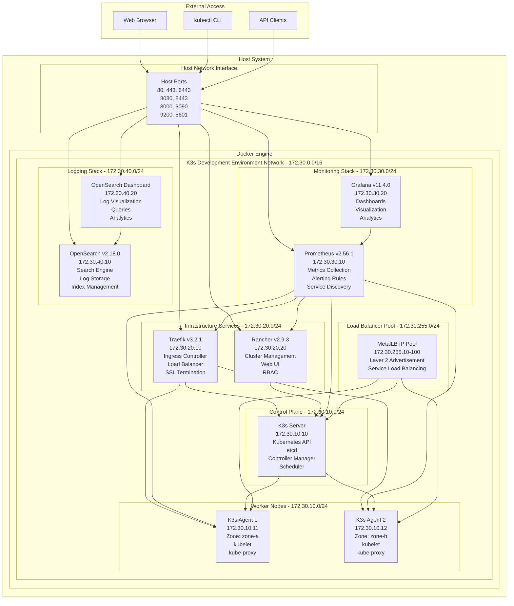

## 🌐 Network Architecture

### Network Segmentation

The environment uses a single Docker bridge network (`172.30.0.0/16`) with logical subnets:

| Subnet | Purpose | Components |
|--------|---------|------------|
| `172.30.10.0/24` | Kubernetes Cluster | K3s server and agents |
| `172.30.20.0/24` | Infrastructure Services | Traefik, Rancher |
| `172.30.30.0/24` | Monitoring | Prometheus, Grafana |
| `172.30.40.0/24` | Logging | OpenSearch, Dashboard |
| `172.30.255.0/24` | Load Balancer Pool | MetalLB IP allocation |

### Network Flow

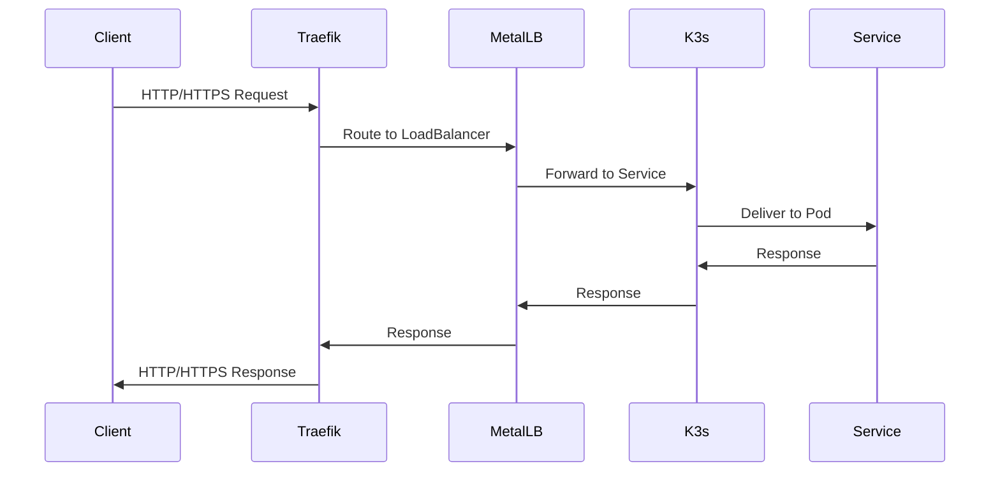

### DNS Resolution

Local DNS resolution is handled through `/etc/hosts` entries:

```
127.0.0.1 rancher.dev
127.0.0.1 traefik.dev
127.0.0.1 grafana.dev
127.0.0.1 prometheus.dev
127.0.0.1 opensearch.dev
127.0.0.1 opensearch-dashboard.dev
```

## 🔧 Component Architecture

### K3s Cluster

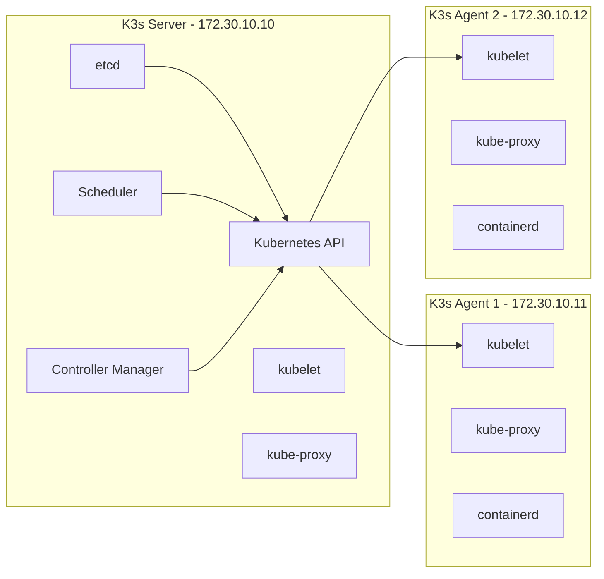

### Traefik Ingress

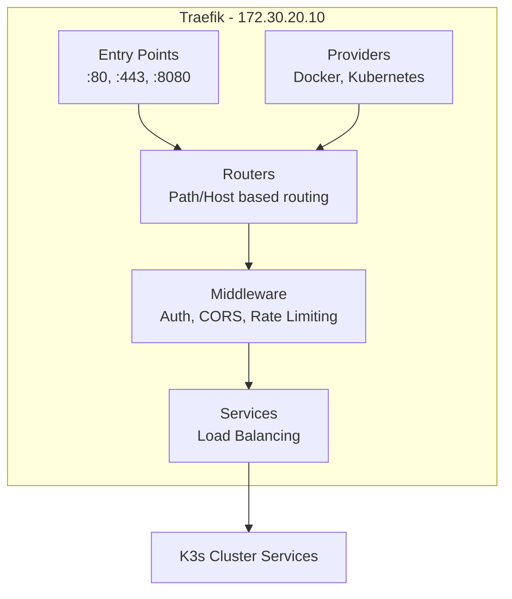

### Monitoring Stack

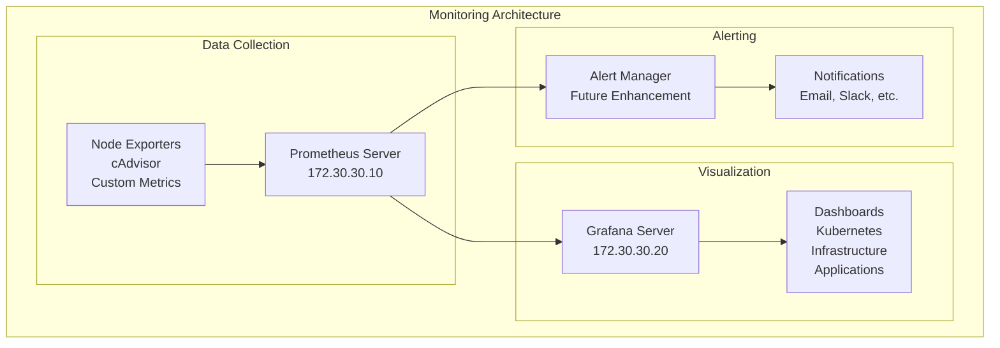

## 💾 Data Architecture

### Persistent Storage

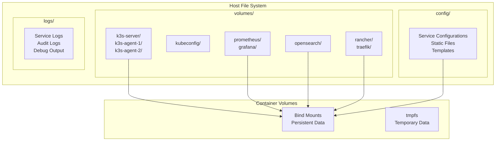

### Data Flow

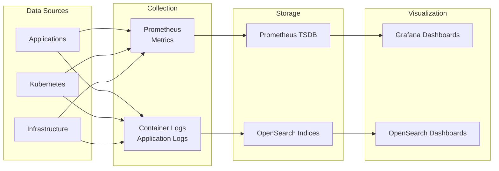

## 🔒 Security Architecture

### Network Security

```mermaid
graph TB
    subgraph "Security Layers"
        subgraph "Network Isolation"
            DOCKER_NET[Docker Bridge Network<br/>172.30.0.0/16]
            SUBNETS[Logical Subnets<br/>Service Segregation]
        end
        
        subgraph "Access Control"
            RBAC[Kubernetes RBAC<br/>Role-based Access]
            AUTH[Service Authentication<br/>Basic Auth, TLS]
        end
        
        subgraph "Data Protection"
            TLS[TLS Termination<br/>at Traefik]
            SECRETS[Kubernetes Secrets<br/>Environment Variables]
        end
        
        subgraph "Monitoring"
            AUDIT[Audit Logging<br/>Access Monitoring]
            ALERTS[Security Alerts<br/>Anomaly Detection]
        end
    end
    
    DOCKER_NET --> SUBNETS
    SUBNETS --> RBAC
    RBAC --> AUTH
    AUTH --> TLS
    TLS --> SECRETS
    SECRETS --> AUDIT
    AUDIT --> ALERTS
```

### Security Boundaries

1. **Host Isolation**: Containers isolated from host system
2. **Network Isolation**: Dedicated Docker network
3. **Service Isolation**: Fixed IP addressing and port allocation
4. **Data Isolation**: Separate volumes for each service
5. **Access Control**: Authentication required for management interfaces

## 🔄 Deployment Architecture

### Deployment Process

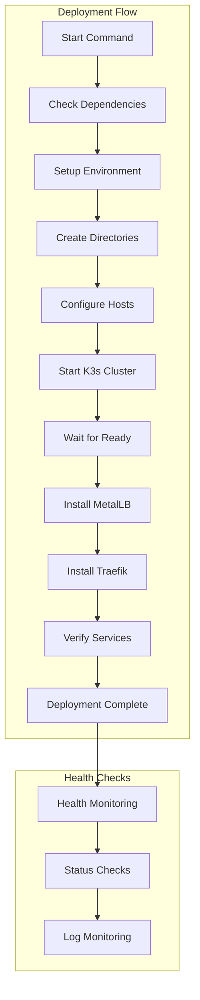

### Service Dependencies

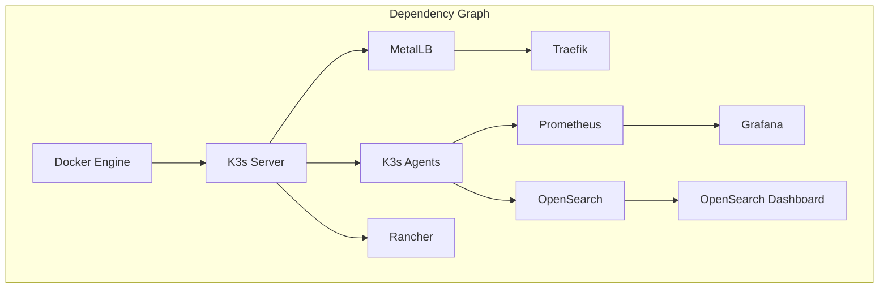

## 📊 Performance Characteristics

### Resource Requirements

| Component | CPU | Memory | Storage | Network |
|-----------|-----|--------|---------|---------|
| K3s Server | 1-2 cores | 2-4 GB | 10 GB | 1 Gbps |
| K3s Agent | 0.5-1 core | 1-2 GB | 5 GB | 1 Gbps |
| Rancher | 0.5-1 core | 1-2 GB | 2 GB | 100 Mbps |
| Traefik | 0.25-0.5 core | 256-512 MB | 1 GB | 1 Gbps |
| Prometheus | 0.5-1 core | 1-2 GB | 10 GB | 100 Mbps |
| Grafana | 0.25-0.5 core | 256-512 MB | 2 GB | 100 Mbps |
| OpenSearch | 1-2 cores | 2-4 GB | 20 GB | 100 Mbps |

### Scaling Characteristics

- **Horizontal Scaling**: Add more K3s agent nodes
- **Vertical Scaling**: Increase container resource limits
- **Storage Scaling**: Expand persistent volumes
- **Network Scaling**: Multiple load balancer IPs

## 🔧 Configuration Management

### Configuration Sources

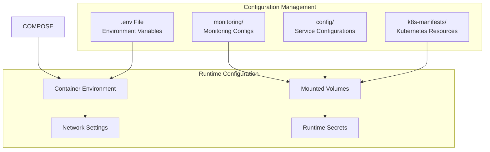

This architecture provides a solid foundation for Kubernetes development with enterprise-grade monitoring, management, and networking capabilities.
