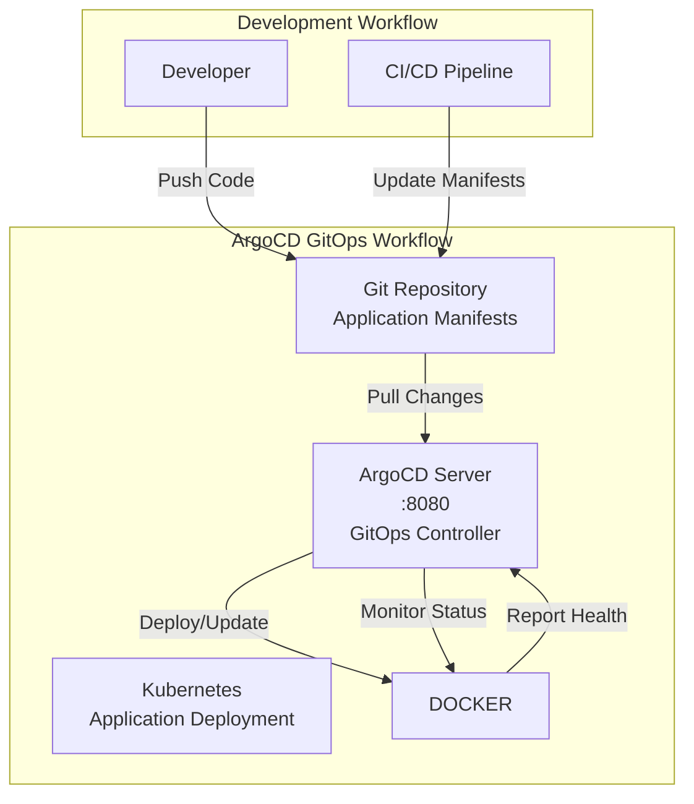

# ArgoCD Documentation

## 🔄 Overview

ArgoCD is a declarative, GitOps continuous delivery tool for Kubernetes applications. In our K3s environment, ArgoCD manages application deployments through Git repositories, providing automated synchronization and rollback capabilities.

## 🏗️ Architecture



## 🚀 Quick Start

### Access ArgoCD UI

1. **Start the environment**:
   ```bash
   ./dev-env.sh start
   ```

2. **Access ArgoCD**:
   - URL: http://argocd.local
   - Username: `admin`
   - Password: Run `./dev-env.sh logs argocd` to get initial password

3. **Verify ArgoCD is running**:
   ```bash
   curl -I http://argocd.local
   # Should return 200 OK
   ```

### Setting Up Your First Application

1. **Log in to ArgoCD UI**
2. **Click "NEW APP"**
3. **Configure application**:
   - **Application Name**: `my-app`
   - **Project**: `default`
   - **Repository URL**: Your Git repository
   - **Path**: Path to your manifests
   - **Destination Server**: `https://kubernetes.default.svc`
   - **Namespace**: `default`

## 📋 Configuration

### Kubernetes Configuration

ArgoCD deployment configuration:

```yaml
apiVersion: apps/v1
kind: Deployment
metadata:
  name: argocd-server
  namespace: argocd
spec:
  selector:
    matchLabels:
      app.kubernetes.io/name: argocd-server
  template:
    metadata:
      labels:
        app.kubernetes.io/name: argocd-server
    spec:
      containers:
      - name: argocd-server
        image: quay.io/argoproj/argocd:latest
        ports:
        - containerPort: 8080
        env:
        - name: ARGOCD_SERVER_INSECURE
          value: "true"
        - name: ARGOCD_SERVER_ROOTPATH
          value: "/"
---
apiVersion: v1
kind: Service
metadata:
  name: argocd-server
  namespace: argocd
spec:
  selector:
    app.kubernetes.io/name: argocd-server
  ports:
  - port: 80
    targetPort: 8080
```

### GitOps Repository Structure

Recommended repository structure for ArgoCD:

```
my-gitops-repo/
├── applications/
│   ├── staging/
│   │   ├── app1/
│   │   │   ├── deployment.yaml
│   │   │   └── service.yaml
│   │   └── app2/
│   └── production/
│       ├── app1/
│       └── app2/
├── infrastructure/
│   ├── monitoring/
│   └── networking/
└── argocd/
    ├── applications/
    │   ├── staging-apps.yaml
    │   └── prod-apps.yaml
    └── projects/
        └── default-project.yaml
```

## 🔧 Common Tasks

### Creating an Application via CLI

```bash
# Install ArgoCD CLI
brew install argocd

# Login to ArgoCD
argocd login argocd.local

# Create application
argocd app create my-app \
  --repo https://github.com/your-org/your-repo \
  --path manifests \
  --dest-server https://kubernetes.default.svc \
  --dest-namespace default

# Sync application
argocd app sync my-app
```

### Application Management

```bash
# List applications
argocd app list

# Get application details
argocd app get my-app

# Delete application
argocd app delete my-app
```

### Repository Management

```bash
# Add repository
argocd repo add https://github.com/your-org/your-repo

# List repositories
argocd repo list

# Remove repository
argocd repo rm https://github.com/your-org/your-repo
```

## 📊 Monitoring & Observability

### Application Health

ArgoCD provides built-in health checks for applications:

- **Healthy**: All resources are running as expected
- **Progressing**: Resources are being updated
- **Degraded**: Some resources are not healthy
- **Missing**: Resources are not found

### Sync Status

- **Synced**: Application is in sync with Git
- **OutOfSync**: Application differs from Git
- **Unknown**: Sync status cannot be determined

### Metrics Integration

ArgoCD metrics are available at:
- Prometheus: http://prometheus.local (ArgoCD metrics auto-discovered)
- Grafana: http://grafana.local (Import ArgoCD dashboard)

## 🚨 Troubleshooting

### Common Issues

1. **ArgoCD UI not accessible**:
   ```bash
   # Check if service is running
   docker ps | grep argocd
   
   # Check logs
   ./dev-env.sh logs argocd
   
   # Restart service
   ./dev-env.sh restart
   ```

2. **Application stuck in "Progressing" state**:
   ```bash
   # Check application events
   argocd app get my-app
   
   # Force refresh
   argocd app refresh my-app
   
   # Hard refresh (ignore cache)
   argocd app refresh my-app --hard
   ```

3. **Repository connection issues**:
   ```bash
   # Test repository access
   argocd repo get https://github.com/your-org/your-repo
   
   # Add SSH key for private repos
   argocd repo add git@github.com:your-org/your-repo --ssh-private-key-path ~/.ssh/id_rsa
   ```

4. **Sync failures**:
   ```bash
   # Check sync policy
   argocd app set my-app --sync-policy automated
   
   # Manual sync with prune
   argocd app sync my-app --prune
   ```

### Log Analysis

```bash
# View ArgoCD server logs
./dev-env.sh logs argocd

# Follow logs in real-time
./dev-env.sh logs argocd -f

# View specific application controller logs
docker logs k3s-dev-environment-argocd-1 | grep "my-app"
```

## 🔐 Security & Best Practices

### RBAC Configuration

```yaml
# rbac-config.yaml
policy.default: role:readonly
policy.csv: |
  p, role:admin, applications, *, */*, allow
  p, role:admin, clusters, *, *, allow
  p, role:admin, repositories, *, *, allow
  g, admin, role:admin
```

### Private Repository Access

1. **SSH Keys**:
   ```bash
   # Generate SSH key for ArgoCD
   ssh-keygen -t rsa -f ~/.ssh/argocd_rsa
   
   # Add to ArgoCD
   argocd repo add git@github.com:your-org/private-repo \
     --ssh-private-key-path ~/.ssh/argocd_rsa
   ```

2. **Personal Access Tokens**:
   ```bash
   # For GitHub/GitLab
   argocd repo add https://github.com/your-org/private-repo \
     --username your-username \
     --password your-token
   ```

### Resource Management

- **Resource Limits**: Set appropriate CPU/memory limits
- **Sync Policies**: Use automatic sync with caution in production
- **Pruning**: Enable resource pruning for clean deployments
- **Self-Healing**: Configure self-healing for automatic recovery

## 📚 Integration Examples

### CI/CD Pipeline Integration

```yaml
# .github/workflows/deploy.yml
name: Deploy with ArgoCD
on:
  push:
    branches: [main]

jobs:
  deploy:
    runs-on: ubuntu-latest
    steps:
      - uses: actions/checkout@v3
      
      - name: Update manifest
        run: |
          sed -i "s/image: .*/image: myapp:${{ github.sha }}/" k8s/deployment.yaml
          
      - name: Commit changes
        run: |
          git config --local user.email "action@github.com"
          git config --local user.name "GitHub Action"
          git add k8s/
          git commit -m "Update image to ${{ github.sha }}"
          git push
```

### Multi-Environment Setup

```yaml
# applications/staging.yaml
apiVersion: argoproj.io/v1alpha1
kind: Application
metadata:
  name: myapp-staging
  namespace: argocd
spec:
  project: default
  source:
    repoURL: https://github.com/your-org/your-repo
    targetRevision: HEAD
    path: manifests/staging
  destination:
    server: https://kubernetes.default.svc
    namespace: staging
  syncPolicy:
    automated:
      prune: true
      selfHeal: true
```

## 🎯 Performance Optimization

### Repository Optimization

- **Shallow Clones**: Enable shallow clones for large repositories
- **Cache**: Configure repository caching for faster syncs
- **Webhooks**: Set up webhooks for immediate sync triggers

### Application Management

- **Resource Filters**: Use resource filters to exclude unnecessary resources
- **Sync Windows**: Configure sync windows to control deployment timing
- **Progressive Delivery**: Implement canary deployments with ArgoCD

## 📈 Advanced Configuration

### Custom Health Checks

```yaml
# Custom health check for your application
apiVersion: v1
kind: ConfigMap
metadata:
  name: argocd-cm
  namespace: argocd
data:
  resource.customizations.health.argoproj.io_Rollout: |
    hs = {}
    if obj.status ~= nil then
      if obj.status.replicas ~= nil and obj.status.replicas > 0 then
        hs.status = "Healthy"
        hs.message = "Rollout is healthy"
      else
        hs.status = "Progressing"
        hs.message = "Rollout is progressing"
      end
    end
    return hs
```

### Notification Configuration

```yaml
# notifications-cm.yaml
apiVersion: v1
kind: ConfigMap
metadata:
  name: argocd-notifications-cm
  namespace: argocd
data:
  service.slack: |
    token: $slack-token
  template.app-deployed: |
    message: Application {{.app.metadata.name}} is now running new version.
  trigger.on-deployed: |
    - when: app.status.operationState.phase in ['Succeeded'] and app.status.health.status == 'Healthy'
      send: [app-deployed]
```

---

**🔗 Useful Links:**
- [ArgoCD Documentation](https://argo-cd.readthedocs.io/)
- [GitOps Best Practices](https://www.gitops.tech/)
- [ArgoCD Examples](https://github.com/argoproj/argocd-example-apps)

**📞 Support:**
- Check logs: `./dev-env.sh logs argocd`
- Restart service: `./dev-env.sh restart`
- Community: [ArgoCD Slack](https://argoproj.github.io/community/join-slack)
