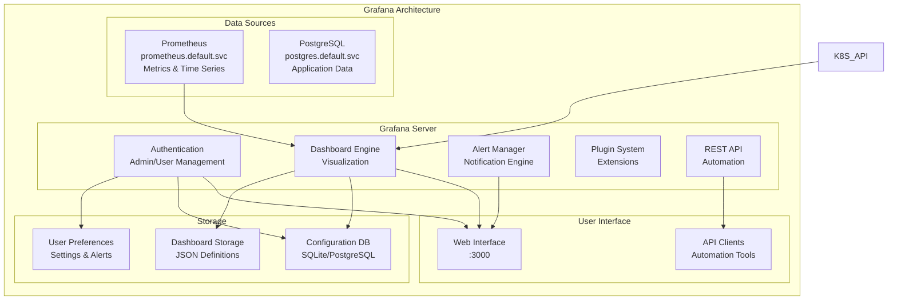
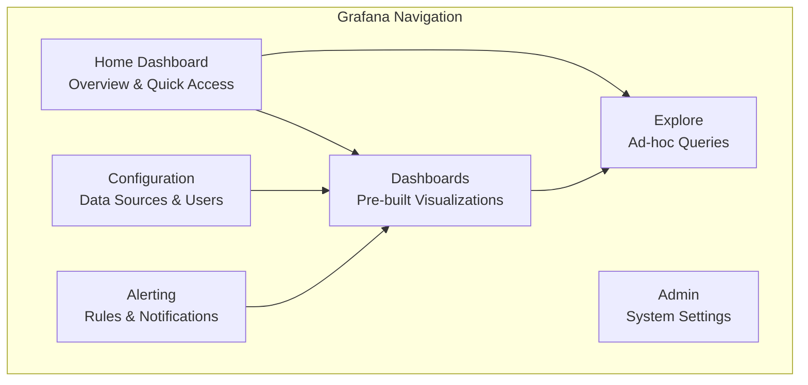
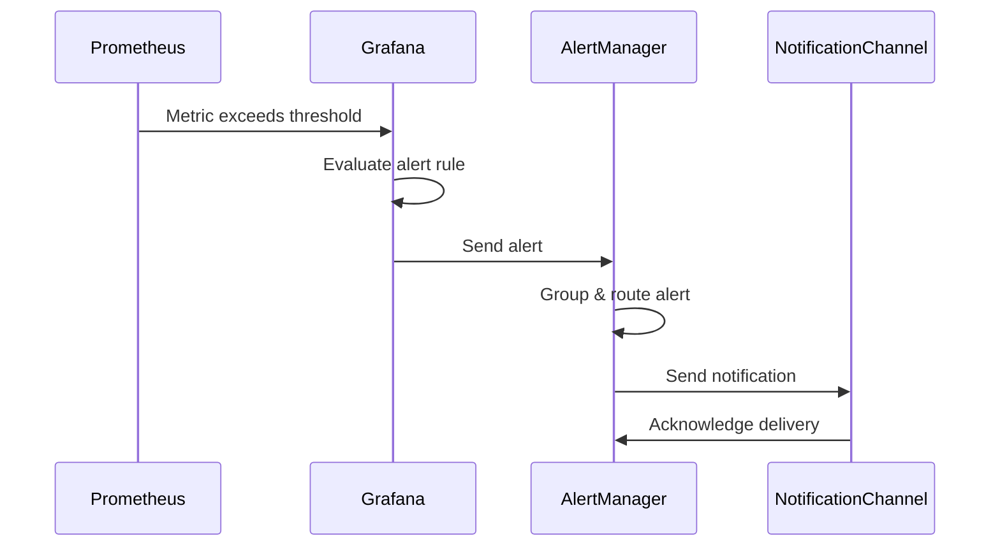

# Grafana Documentation

## 📊 Overview

Grafana is our primary metrics visualization and dashboard platform in the Kubernetes development environment. It provides beautiful, interactive dashboards for monitoring cluster metrics, infrastructure, and application performance.

## 🏗️ Architecture



## 🔧 Configuration

### Kubernetes Configuration

Grafana is deployed as a Kubernetes Deployment with the following configuration:

```yaml
apiVersion: apps/v1
kind: Deployment
metadata:
  name: grafana
  namespace: default
spec:
  replicas: 1
  selector:
    matchLabels:
      app: grafana
  template:
    metadata:
      labels:
        app: grafana
    spec:
      containers:
      - name: grafana
        image: grafana/grafana:11.4.0
        ports:
        - containerPort: 3000
        env:
        - name: GF_SECURITY_ADMIN_USER
          value: "admin"
        - name: GF_SECURITY_ADMIN_PASSWORD
          value: "admin"
        - name: GF_INSTALL_PLUGINS
          value: "grafana-kubernetes-app,grafana-polystat-panel,grafana-piechart-panel"
        volumeMounts:
        - name: grafana-storage
          mountPath: /var/lib/grafana
        - name: datasources-config
          mountPath: /etc/grafana/provisioning/datasources
        - name: dashboards-config
          mountPath: /etc/grafana/provisioning/dashboards
      volumes:
      - name: grafana-storage
        persistentVolumeClaim:
          claimName: grafana-pvc
      - name: datasources-config
        configMap:
          name: grafana-datasources
      - name: dashboards-config
        configMap:
          name: grafana-dashboards
---
apiVersion: v1
kind: Service
metadata:
  name: grafana
  namespace: default
spec:
  selector:
    app: grafana
  ports:
  - port: 3000
    targetPort: 3000
  type: ClusterIP
```

### Data Sources Configuration

ConfigMap for datasources configuration:

```yaml
apiVersion: 1

datasources:
  - name: Prometheus
    type: prometheus
    access: proxy
    url: http://172.30.30.10:9090
    isDefault: true
    editable: true
    jsonData:
      timeInterval: "5s"
      queryTimeout: "60s"
      httpMethod: "GET"
    
  - name: OpenSearch
    type: opensearch
    access: proxy
    url: http://172.30.40.10:9200
    database: "*"
    basicAuth: true
    basicAuthUser: admin
    secureJsonData:
      basicAuthPassword: SecureOpenSearchPass123!
    jsonData:
      timeField: "@timestamp"
      interval: "Daily"
      
  - name: Kubernetes
    type: kubernetes
    access: proxy
    url: https://172.30.10.10:6443
    editable: true
    jsonData:
      tlsSkipVerify: true
```

### Dashboard Provisioning

Located at `config/grafana/dashboards.yml`:

```yaml
apiVersion: 1

providers:
  - name: 'default'
    orgId: 1
    folder: ''
    type: file
    disableDeletion: false
    updateIntervalSeconds: 10
    allowUiUpdates: true
    options:
      path: /var/lib/grafana/dashboards
```

## 📊 Pre-configured Dashboards

### 1. Kubernetes Cluster Overview

**File**: `config/grafana/dashboards/kubernetes-cluster.json`

**Metrics Displayed**:
- Cluster resource utilization (CPU, Memory, Storage)
- Node status and health
- Pod distribution across nodes
- Network traffic patterns
- API server performance

**Key Panels**:
```
- Cluster CPU Usage (%)
- Cluster Memory Usage (%)
- Node Count & Status
- Pod Count by Namespace
- Network I/O
- Storage Usage
- API Request Rate
- etcd Performance
```

### 2. Node Performance Dashboard

**File**: `config/grafana/dashboards/node-performance.json`

**Metrics Displayed**:
- Individual node CPU, memory, disk usage
- Network interface statistics
- System load averages
- Container resource consumption

### 3. Application Monitoring Dashboard

**File**: `config/grafana/dashboards/application-monitoring.json`

**Metrics Displayed**:
- Application-specific metrics
- HTTP request rates and latencies
- Error rates and status codes
- Custom business metrics

### 4. Infrastructure Services Dashboard

**File**: `config/grafana/dashboards/infrastructure.json`

**Metrics Displayed**:
- Traefik performance and routing
- Rancher system health
- Prometheus metrics collection
- OpenSearch cluster status

## 🚀 Getting Started

### First-Time Setup

1. **Access Grafana**:
   ```bash
   # Ensure environment is running
   ./scripts/setup-k3s.sh start
   
   # Access via browser
   open http://grafana.dev:3000
   ```

2. **Login with Default Credentials**:
   - **Username**: `admin`
   - **Password**: `SecureGrafanaPass123!`

3. **Verify Data Sources**:
   - Navigate to Configuration → Data Sources
   - Verify Prometheus connection (green status)
   - Test OpenSearch connection

4. **Import Dashboards**:
   - Dashboards should auto-load from provisioning
   - If not, import manually from `/config/grafana/dashboards/`

### Basic Navigation



### Quick Actions

```bash
# View Grafana logs
kubectl logs deployment/grafana

# Restart Grafana service
kubectl rollout restart deployment/grafana

# Access Grafana CLI inside pod
kubectl exec -it deployment/grafana -- grafana-cli admin reset-admin-password newpassword

# Backup Grafana data
docker exec grafana tar czf - /var/lib/grafana | gzip > grafana-backup-$(date +%Y%m%d).tar.gz

# Restore Grafana data
gunzip -c grafana-backup-YYYYMMDD.tar.gz | docker exec -i grafana tar xzf - -C /
```

## 📈 Dashboard Development

### Creating Custom Dashboards

1. **Dashboard Structure**:
   ```json
   {
     "dashboard": {
       "id": null,
       "title": "Custom Dashboard",
       "tags": ["kubernetes", "custom"],
       "timezone": "browser",
       "panels": [...],
       "time": {
         "from": "now-1h",
         "to": "now"
       },
       "refresh": "30s"
     }
   }
   ```

2. **Panel Types**:
   - **Time Series**: For metrics over time
   - **Stat**: For single value displays
   - **Gauge**: For percentage/threshold displays
   - **Bar Chart**: For categorical data
   - **Heatmap**: For distribution analysis
   - **Table**: For structured data display

3. **Query Examples**:

   **CPU Usage by Node**:
   ```promql
   100 - (avg(irate(node_cpu_seconds_total{mode="idle"}[5m])) by (instance) * 100)
   ```

   **Memory Usage**:
   ```promql
   (1 - (node_memory_MemAvailable_bytes / node_memory_MemTotal_bytes)) * 100
   ```

   **Pod Count by Namespace**:
   ```promql
   count by (namespace) (kube_pod_info)
   ```

### Dashboard Best Practices

1. **Organization**:
   - Group related metrics in rows
   - Use consistent time ranges
   - Apply appropriate refresh intervals

2. **Visualization**:
   - Choose appropriate panel types
   - Use consistent color schemes
   - Include meaningful titles and descriptions

3. **Performance**:
   - Limit query time ranges
   - Use efficient PromQL queries
   - Avoid too many panels per dashboard

## 🔔 Alerting

### Alert Rule Configuration

```yaml
# Example alert rule
groups:
  - name: kubernetes-alerts
    rules:
      - alert: HighCPUUsage
        expr: 100 - (avg(irate(node_cpu_seconds_total{mode="idle"}[5m])) * 100) > 80
        for: 2m
        labels:
          severity: warning
        annotations:
          summary: "High CPU usage detected"
          description: "CPU usage is above 80% for more than 2 minutes"
```

### Notification Channels

1. **Email Notifications**:
   ```json
   {
     "name": "email-alerts",
     "type": "email",
     "settings": {
       "addresses": "admin@company.com",
       "subject": "Grafana Alert: {{ .CommonLabels.alertname }}"
     }
   }
   ```

2. **Slack Integration**:
   ```json
   {
     "name": "slack-alerts",
     "type": "slack",
     "settings": {
       "url": "https://hooks.slack.com/services/...",
       "channel": "#alerts",
       "username": "Grafana"
     }
   }
   ```

### Alert Management Flow



## 🔍 Troubleshooting

### Common Issues

1. **Data Source Connection Failed**:
   ```bash
   # Check network connectivity
   kubectl exec deployment/grafana -- ping prometheus
   
   # Verify service status
   kubectl get pods -l app=grafana
   ```

2. **Dashboards Not Loading**:
   ```bash
   # Check provisioning directory
   docker exec grafana ls -la /etc/grafana/provisioning/dashboards/
   
   # Verify dashboard files
   docker exec grafana ls -la /var/lib/grafana/dashboards/
   
   # Check Grafana logs
   docker logs grafana | grep -i error
   ```

3. **Performance Issues**:
   ```bash
   # Monitor resource usage
   docker stats grafana
   
   # Check query performance
   # Navigate to Explore → Query Inspector
   
   # Optimize dashboard queries
   # Reduce time ranges and panel count
   ```

### Debug Commands

```bash
# Access Grafana CLI
docker exec -it grafana bash

# Check Grafana configuration
docker exec grafana cat /etc/grafana/grafana.ini

# View database content (SQLite)
docker exec grafana sqlite3 /var/lib/grafana/grafana.db ".tables"

# Export dashboard as JSON
# Use Grafana UI: Dashboard Settings → JSON Model

# Reset admin password
docker exec grafana grafana-cli admin reset-admin-password newpassword
```

### Log Analysis

```bash
# Real-time log monitoring
docker logs -f grafana

# Filter specific log levels
docker logs grafana | grep -E "(ERROR|WARN)"

# Check authentication logs
docker logs grafana | grep -i auth

# Monitor query performance
docker logs grafana | grep -i "query"
```

## 📚 Advanced Features

### Plugin Management

```bash
# List installed plugins
docker exec grafana grafana-cli plugins ls

# Install new plugin
kubectl exec deployment/grafana -- grafana-cli plugins install grafana-worldmap-panel

# Restart after plugin installation
kubectl rollout restart deployment/grafana
```

### API Usage

```bash
# Get all dashboards
curl -u admin:SecureGrafanaPass123! \
  http://localhost:3000/api/search?type=dash-db

# Create dashboard via API
curl -X POST \
  -H "Content-Type: application/json" \
  -u admin:SecureGrafanaPass123! \
  -d @dashboard.json \
  http://localhost:3000/api/dashboards/db

# Get organization users
curl -u admin:SecureGrafanaPass123! \
  http://localhost:3000/api/org/users
```

### Custom Themes

1. **Create custom CSS**:
   ```css
   /* custom-theme.css */
   .theme-dark .panel-container {
     background-color: #1f1f1f;
     border: 1px solid #444;
   }
   ```

2. **Apply theme via config**:
   ```ini
   [server]
   serve_from_sub_path = true
   root_url = http://localhost:3000/grafana/
   
   [auth.anonymous]
   enabled = true
   org_role = Viewer
   ```

## 🔗 Integration Points

### With Prometheus
- **Metrics ingestion**: Primary data source
- **Alert rule evaluation**: Based on Prometheus queries
- **Service discovery**: Auto-discovery of targets

### With OpenSearch
- **Log correlation**: Link metrics to logs
- **Event analysis**: Search and analyze events
- **Dashboard embedding**: Embed log queries in dashboards

### With Kubernetes
- **Resource monitoring**: Cluster and application metrics
- **Event correlation**: K8s events with metrics
- **Auto-discovery**: Dynamic service monitoring

## 📖 References

- [Grafana Documentation](https://grafana.com/docs/grafana/latest/)
- [PromQL Guide](https://prometheus.io/docs/prometheus/latest/querying/basics/)
- [Dashboard Best Practices](https://grafana.com/docs/grafana/latest/best-practices/)
- [Alerting Guide](https://grafana.com/docs/grafana/latest/alerting/)
- [Plugin Development](https://grafana.com/docs/grafana/latest/developers/plugins/)

## 📄 Session Files

### Quick Start Session
**File**: `docs/grafana/sessions/quick-start.md`
- Environment setup verification
- Dashboard import process
- Basic query examples

### Dashboard Development Session
**File**: `docs/grafana/sessions/dashboard-development.md`
- Custom dashboard creation
- Panel configuration
- Query optimization

### Alerting Configuration Session
**File**: `docs/grafana/sessions/alerting-setup.md`
- Alert rule creation
- Notification channel setup
- Testing and validation
