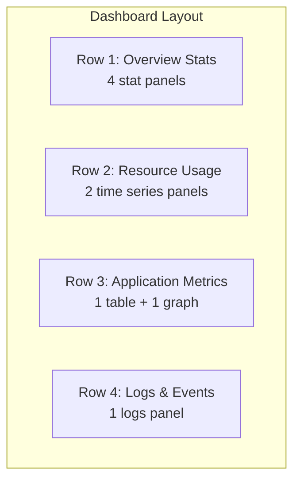

# Dashboard Development Session

## 🎯 Objective
Learn to create custom Grafana dashboards for monitoring Kubernetes applications and infrastructure.

## 📋 Prerequisites
- Completed Grafana Quick Start Session
- Understand basic PromQL concepts
- Know your monitoring requirements

## 🚀 Session Outline

### Part 1: Dashboard Creation Fundamentals (15 minutes)

#### Step 1: Create New Dashboard
1. **Navigate to Dashboards → New → New Dashboard**
2. **Dashboard Settings**:
   - Title: "My Custom K8s Dashboard"
   - Description: "Custom monitoring for my applications"
   - Tags: "kubernetes", "custom", "monitoring"
   - Time Zone: "Default"
   - Auto-refresh: "30s"

#### Step 2: Dashboard Structure Planning


#### Step 3: Add First Panel - CPU Overview
1. **Click "Add Panel"**
2. **Panel configuration**:
   - Type: "Stat"
   - Title: "Cluster CPU Usage"
   - Unit: "Percent (0-100)"
   - Thresholds: Green (0-70), Yellow (70-85), Red (85-100)

3. **Query configuration**:
   ```promql
   100 - (avg(irate(node_cpu_seconds_total{mode="idle"}[5m])) * 100)
   ```

4. **Panel options**:
   - Color mode: "Value"
   - Graph mode: "Area"
   - Show: "All values"

### Part 2: Advanced Panel Types (20 minutes)

#### Step 4: Time Series Panel - Memory Usage Over Time
1. **Add new panel → Time series**
2. **Query A**:
   ```promql
   (1 - (node_memory_MemAvailable_bytes / node_memory_MemTotal_bytes)) * 100
   ```
   Legend: "Memory Usage %"

3. **Query B**:
   ```promql
   node_memory_SwapCached_bytes / node_memory_SwapTotal_bytes * 100
   ```
   Legend: "Swap Usage %"

4. **Panel styling**:
   - Left Y-axis: "Percent (0-100)"
   - Draw style: "Line"
   - Line interpolation: "Linear"
   - Fill opacity: 20

#### Step 5: Table Panel - Pod Resources
1. **Add new panel → Table**
2. **Query**:
   ```promql
   sum by (namespace, pod) (container_memory_usage_bytes{container!="POD",container!=""})
   ```

3. **Transform data**:
   - Add transformation: "Group by"
   - Group by: "namespace", "pod"
   - Aggregation: "Last"

4. **Field overrides**:
   - Memory column: Unit "bytes"
   - Add threshold colors

#### Step 6: Gauge Panel - Storage Usage
1. **Add new panel → Gauge**
2. **Query**:
   ```promql
   (1 - (node_filesystem_avail_bytes{fstype!="tmpfs",fstype!="rootfs"} / node_filesystem_size_bytes{fstype!="tmpfs",fstype!="rootfs"})) * 100
   ```

3. **Gauge options**:
   - Min: 0, Max: 100
   - Thresholds: 70 (yellow), 85 (red)
   - Show threshold markers: Yes

### Part 3: Dashboard Organization (10 minutes)

#### Step 7: Add Rows and Organization
1. **Add row**: Click "Add panel" → "Add row"
2. **Row title**: "Resource Utilization"
3. **Drag panels** into appropriate rows
4. **Panel sizing**: Resize panels for optimal layout

#### Step 8: Variable Creation
1. **Dashboard settings → Variables → New**
2. **Create namespace variable**:
   - Name: "namespace"
   - Type: "Query"
   - Data source: "Prometheus"
   - Query: `label_values(kube_pod_info, namespace)`
   - Multi-value: Yes
   - Include All: Yes

3. **Use variable in queries**:
   ```promql
   # Replace static queries with variable
   sum by (pod) (container_memory_usage_bytes{namespace=~"$namespace",container!="POD"})
   ```

### Part 4: Advanced Features (15 minutes)

#### Step 9: Panel Links and Drilldown
1. **Edit panel → Panel options → Links**
2. **Add link to detailed dashboard**:
   - Title: "View Node Details"
   - URL: `/d/node-details?var-node=${__field.labels.instance}`
   - Open in new tab: Yes

#### Step 10: Annotations
1. **Dashboard settings → Annotations → New**
2. **Kubernetes events annotation**:
   - Name: "K8s Events"
   - Data source: "Prometheus"
   - Query: `increase(kube_events_total[1m]) > 0`
   - Color: Orange

#### Step 11: Alert Rules
1. **Edit panel → Alert → Create alert rule**
2. **Alert condition**:
   - Query: CPU usage query from earlier
   - Condition: "IS ABOVE 80"
   - Evaluation: "Every 1m for 2m"

3. **Alert details**:
   - Rule name: "High CPU Usage"
   - Message: "CPU usage is above 80% for 2 minutes"
   - Tags: "severity: warning"

### Part 5: Dashboard Finalization (10 minutes)

#### Step 12: Dashboard Polish
1. **Panel descriptions**: Add helpful descriptions to each panel
2. **Color consistency**: Ensure consistent color scheme
3. **Panel alignment**: Align panels properly
4. **Time range**: Set appropriate default time range

#### Step 13: Save and Export
1. **Save dashboard**: Ctrl+S or click save icon
2. **Export dashboard**:
   - Dashboard settings → JSON Model
   - Copy JSON for backup/sharing

3. **Share dashboard**:
   - Dashboard settings → Share
   - Generate shareable link

## 📊 Example Dashboard JSON Structure

```json
{
  "dashboard": {
    "id": null,
    "title": "My Custom K8s Dashboard",
    "tags": ["kubernetes", "custom"],
    "timezone": "browser",
    "panels": [
      {
        "id": 1,
        "title": "Cluster CPU Usage",
        "type": "stat",
        "targets": [
          {
            "expr": "100 - (avg(irate(node_cpu_seconds_total{mode=\"idle\"}[5m])) * 100)",
            "legendFormat": "CPU Usage %"
          }
        ],
        "fieldConfig": {
          "defaults": {
            "unit": "percent",
            "thresholds": {
              "steps": [
                {"color": "green", "value": 0},
                {"color": "yellow", "value": 70},
                {"color": "red", "value": 85}
              ]
            }
          }
        }
      }
    ],
    "time": {
      "from": "now-1h",
      "to": "now"
    },
    "refresh": "30s"
  }
}
```

## 🎨 Dashboard Best Practices

### Visual Design
- **Consistent colors**: Use same color palette across panels
- **Logical grouping**: Group related metrics in rows
- **Appropriate panel sizes**: Important metrics get larger panels
- **Clear titles**: Descriptive but concise panel titles

### Query Optimization
- **Efficient queries**: Avoid expensive regex or functions
- **Appropriate intervals**: Match scrape intervals
- **Use recording rules**: For complex, frequently-used queries
- **Limit data points**: Use appropriate time ranges

### User Experience
- **Dashboard variables**: Allow filtering and customization
- **Panel links**: Enable drilling down to details
- **Meaningful legends**: Clear metric identification
- **Responsive design**: Works on different screen sizes

## 🔍 Troubleshooting

### Query Performance Issues
```bash
# Check query execution time in Explore
# Navigate to Explore → Query Inspector → Stats

# Optimize slow queries by:
# 1. Reducing time range
# 2. Using recording rules
# 3. Simplifying regex patterns
# 4. Adding rate() functions properly
```

### Data Not Appearing
```bash
# Verify metric exists
curl http://localhost:9090/api/v1/label/__name__/values | grep "metric_name"

# Check scrape targets
curl http://localhost:9090/api/v1/targets

# Verify time range includes data
# Check if metrics started after selected time range
```

### Panel Configuration Issues
```bash
# Common fixes:
# 1. Check unit configuration
# 2. Verify field overrides
# 3. Test queries in Explore first
# 4. Check transform configurations
```

## ✅ Success Criteria

By the end of this session, you should be able to:
- [ ] Create custom dashboards from scratch
- [ ] Configure different panel types (stat, time series, table, gauge)
- [ ] Use dashboard variables for filtering
- [ ] Set up basic alert rules
- [ ] Organize panels in rows
- [ ] Export and share dashboards
- [ ] Apply best practices for dashboard design

## 📚 Next Steps

1. **Create application-specific dashboards**
2. **Set up advanced alerting rules**
3. **Explore dashboard templating**
4. **Integrate with external data sources**
5. **Configure team dashboards and permissions**

## 🕐 Time Estimate
**Total Duration**: 70 minutes
- Dashboard fundamentals: 15 minutes
- Advanced panel types: 20 minutes
- Dashboard organization: 10 minutes
- Advanced features: 15 minutes
- Finalization: 10 minutes

## 📝 Session Notes

### Key Concepts Covered
- Panel types and their use cases
- PromQL query construction
- Dashboard variables and templating
- Alert rule configuration
- Dashboard organization and sharing

### Common Patterns
- Overview → Details dashboard hierarchy
- Resource utilization monitoring
- Application performance tracking
- Infrastructure health monitoring

### Advanced Topics for Future Sessions
- Custom panel plugins
- Advanced templating techniques
- Dashboard provisioning automation
- Multi-datasource correlation
