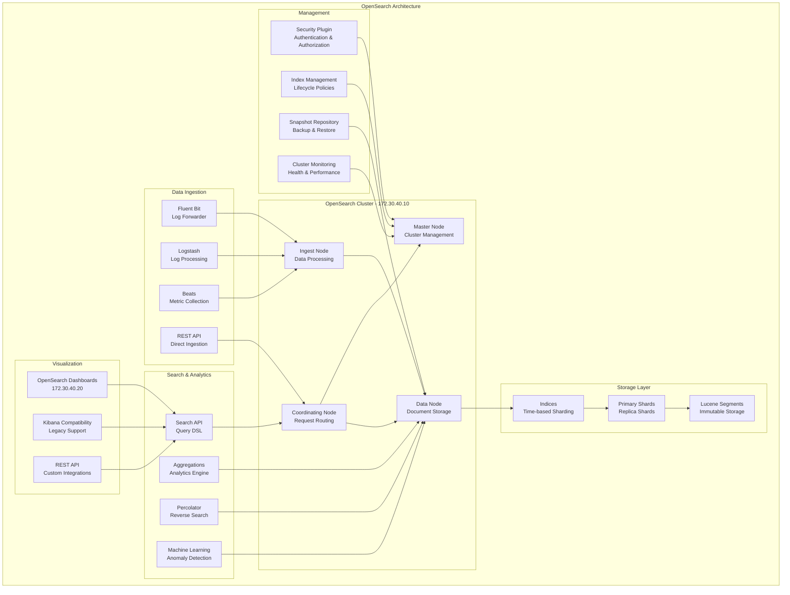

# OpenSearch Documentation

## 🔍 Overview

OpenSearch is our distributed search and analytics engine, providing log aggregation, full-text search, and real-time analytics for the K3s development environment. It serves as the centralized logging solution with powerful search capabilities and visualization tools.

## 🏗️ Architecture



## 🔧 Configuration

### Kubernetes Configuration

```yaml
opensearch:
  image: opensearchproject/opensearch:2.18.0
  container_name: opensearch
  restart: unless-stopped
  networks:
    k3s-dev-net:
      ipv4_address: 172.30.40.10
  ports:
    - "9200:9200"
    - "9300:9300"
  environment:
    # Cluster Configuration
    - cluster.name=k3s-opensearch
    - node.name=opensearch-node1
    - discovery.type=single-node
    - bootstrap.memory_lock=true
    
    # JVM Settings
    - "OPENSEARCH_JAVA_OPTS=-Xms1g -Xmx1g"
    
    # Security Configuration
    - OPENSEARCH_INITIAL_ADMIN_PASSWORD=${OPENSEARCH_ADMIN_PASSWORD:-SecureOpenSearchPass123!}
    - plugins.security.ssl.http.enabled=false
    - plugins.security.ssl.transport.enabled=false
    - plugins.security.disabled=false
    
    # Performance Settings
    - indices.query.bool.max_clause_count=10000
    - search.max_buckets=100000
    - action.auto_create_index=true
    
  ulimits:
    memlock:
      soft: -1
      hard: -1
    nofile:
      soft: 262144
      hard: 262144
  volumes:
    - opensearch-data:/usr/share/opensearch/data
    - ./config/opensearch/opensearch.yml:/usr/share/opensearch/config/opensearch.yml
    - ./config/opensearch/jvm.options:/usr/share/opensearch/config/jvm.options

opensearch-dashboards:
  image: opensearchproject/opensearch-dashboards:2.18.0
  container_name: opensearch-dashboards
  restart: unless-stopped
  networks:
    k3s-dev-net:
      ipv4_address: 172.30.40.20
  ports:
    - "5601:5601"
  environment:
    - OPENSEARCH_HOSTS=http://172.30.40.10:9200
    - OPENSEARCH_USERNAME=admin
    - OPENSEARCH_PASSWORD=${OPENSEARCH_ADMIN_PASSWORD:-SecureOpenSearchPass123!}
    - server.host=0.0.0.0
    - opensearch.ssl.verificationMode=none
  volumes:
    - ./config/opensearch/opensearch_dashboards.yml:/usr/share/opensearch-dashboards/config/opensearch_dashboards.yml
  depends_on:
    - opensearch
```

### OpenSearch Configuration

**File**: `config/opensearch/opensearch.yml`

```yaml
# Cluster Configuration
cluster.name: k3s-opensearch
node.name: opensearch-node1
path.data: /usr/share/opensearch/data
path.logs: /usr/share/opensearch/logs

# Network Configuration
network.host: 0.0.0.0
http.port: 9200
transport.tcp.port: 9300

# Discovery Configuration
discovery.type: single-node
cluster.initial_master_nodes: ["opensearch-node1"]

# Security Configuration
plugins.security.ssl.transport.pemkey_filepath: certificates/opensearch-node1-key.pem
plugins.security.ssl.transport.pemcert_filepath: certificates/opensearch-node1.pem
plugins.security.ssl.transport.pemtrustedcas_filepath: certificates/root-ca.pem
plugins.security.ssl.transport.enforce_hostname_verification: false
plugins.security.ssl.http.enabled: false
plugins.security.ssl.http.pemkey_filepath: certificates/opensearch-node1-key.pem
plugins.security.ssl.http.pemcert_filepath: certificates/opensearch-node1.pem
plugins.security.ssl.http.pemtrustedcas_filepath: certificates/root-ca.pem
plugins.security.allow_unsafe_democertificates: true
plugins.security.allow_default_init_securityindex: true
plugins.security.authcz.admin_dn:
  - CN=kirk,OU=client,O=client,L=test,C=de
plugins.security.audit.type: internal_opensearch
plugins.security.enable_snapshot_restore_privilege: true
plugins.security.check_snapshot_restore_write_privileges: true
plugins.security.restapi.roles_enabled: ["all_access", "security_rest_api_access"]

# Performance Settings
thread_pool.write.queue_size: 10000
thread_pool.search.queue_size: 10000
indices.memory.index_buffer_size: 20%
indices.query.bool.max_clause_count: 10000
search.max_buckets: 100000

# Index Settings
action.auto_create_index: "+logstash-*,+logs-*,+metrics-*,+.opensearch-*,+.opendistro-*,+.security,+.kibana*,-.*"
indices.query.bool.max_clause_count: 10000
indices.fielddata.cache.size: 40%
indices.breaker.fielddata.limit: 60%
indices.breaker.request.limit: 40%
indices.breaker.total.limit: 95%

# Logging Configuration
logger.level: INFO
logger.org.opensearch.security: DEBUG
```

### OpenSearch Dashboards Configuration

**File**: `config/opensearch/opensearch_dashboards.yml`

```yaml
# Server Configuration
server.host: "0.0.0.0"
server.port: 5601
server.name: "opensearch-dashboards"
server.basePath: ""
server.rewriteBasePath: false

# OpenSearch Configuration
opensearch.hosts: ["http://172.30.40.10:9200"]
opensearch.username: "admin"
opensearch.password: "SecureOpenSearchPass123!"
opensearch.ssl.verificationMode: none
opensearch.requestHeadersWhitelist: ["authorization", "securitytenant"]

# Security Configuration
opensearch_security.multitenancy.enabled: true
opensearch_security.multitenancy.tenants.preferred: ["Private", "Global"]
opensearch_security.readonly_mode.roles: ["kibana_read_only"]
opensearch_security.cookie.secure: false

# UI Configuration
opensearchDashboards.index: ".opensearch_dashboards"
opensearchDashboards.defaultAppId: "home"
opensearchDashboards.branding.applicationTitle: "K3s OpenSearch Dashboards"

# Logging Configuration
logging.dest: stdout
logging.silent: false
logging.quiet: false
logging.verbose: false

# Development Settings
data.autocomplete.valueSuggestions.enabled: true
data.autocomplete.valueSuggestions.method: "terms_agg"
data.autocomplete.valueSuggestions.tiers: ["data_content", "data_hot", "data_warm"]

# Visualization Settings
vis_type_vega.enableExternalUrls: true
csp.rules:
  - "script-src 'unsafe-eval' 'self'"
  - "worker-src blob: 'self'"
  - "child-src blob: 'self'"

# Performance Settings
elasticsearch.requestTimeout: 90000
elasticsearch.shardTimeout: 30000
elasticsearch.pingTimeout: 3000
```

### JVM Configuration

**File**: `config/opensearch/jvm.options`

```
# Heap Size (use 50% of available RAM, max 32GB)
-Xms1g
-Xmx1g

# GC Configuration
-XX:+UseG1GC
-XX:G1HeapRegionSize=16m
-XX:+UseG1OldGCMixedGCCountTarget=16
-XX:+DisableExplicitGC
-XX:+AlwaysPreTouch
-XX:+UseStringDeduplication

# JVM Flags
-server
-Djava.awt.headless=true
-Dfile.encoding=UTF-8
-Djna.nosys=true
-XX:-OmitStackTraceInFastThrow
-Dio.netty.noUnsafe=true
-Dio.netty.noKeySetOptimization=true
-Dio.netty.recycler.maxCapacityPerThread=0
-Dlog4j.shutdownHookEnabled=false
-Dlog4j2.disable.jmx=true

# Security Manager
-Djava.security.policy=file:///usr/share/opensearch/config/opensearch.policy

# Temporary directory
-Djava.io.tmpdir=${OPENSEARCH_TMPDIR}

# Heap dumps
-XX:+HeapDumpOnOutOfMemoryError
-XX:HeapDumpPath=/usr/share/opensearch/logs

# GC Logging
-Xlog:gc*,gc+age=trace,safepoint:logs/gc.log:utctime,pid,tid,level
-XX:ErrorFile=/usr/share/opensearch/logs/hs_err_pid%p.log

# Memory Settings
-XX:MaxDirectMemorySize=1g
```

## 🚀 Getting Started

### Initial Setup

1. **Access OpenSearch API**:
   ```bash
   curl -u admin:SecureOpenSearchPass123! http://localhost:9200
   ```

2. **Access OpenSearch Dashboards**:
   ```
   http://opensearch.dev:5601
   # OR
   http://localhost:5601
   ```

3. **Default Credentials**:
   - **Username**: `admin`
   - **Password**: `SecureOpenSearchPass123!`

### Index Management

#### Create Index Template

```bash
curl -X PUT "localhost:9200/_index_template/logs-template" \
  -H 'Content-Type: application/json' \
  -u admin:SecureOpenSearchPass123! \
  -d '{
    "index_patterns": ["logs-*"],
    "template": {
      "settings": {
        "number_of_shards": 2,
        "number_of_replicas": 1,
        "index.refresh_interval": "30s",
        "index.max_result_window": 50000
      },
      "mappings": {
        "properties": {
          "@timestamp": {
            "type": "date",
            "format": "strict_date_optional_time||epoch_millis"
          },
          "level": {
            "type": "keyword"
          },
          "message": {
            "type": "text",
            "fields": {
              "keyword": {
                "type": "keyword",
                "ignore_above": 256
              }
            }
          },
          "service": {
            "type": "keyword"
          },
          "kubernetes": {
            "properties": {
              "namespace": { "type": "keyword" },
              "pod": { "type": "keyword" },
              "container": { "type": "keyword" }
            }
          }
        }
      }
    }
  }'
```

#### Create Index Lifecycle Policy

```bash
curl -X PUT "localhost:9200/_plugins/_ism/policies/logs-policy" \
  -H 'Content-Type: application/json' \
  -u admin:SecureOpenSearchPass123! \
  -d '{
    "policy": {
      "description": "Log lifecycle management",
      "default_state": "hot",
      "states": [
        {
          "name": "hot",
          "actions": [
            {
              "rollover": {
                "min_size": "1GB",
                "min_doc_count": 1000000,
                "min_index_age": "1d"
              }
            }
          ],
          "transitions": [
            {
              "state_name": "warm",
              "conditions": {
                "min_index_age": "7d"
              }
            }
          ]
        },
        {
          "name": "warm",
          "actions": [
            {
              "replica_count": {
                "number_of_replicas": 0
              }
            }
          ],
          "transitions": [
            {
              "state_name": "cold",
              "conditions": {
                "min_index_age": "30d"
              }
            }
          ]
        },
        {
          "name": "cold",
          "actions": [],
          "transitions": [
            {
              "state_name": "delete",
              "conditions": {
                "min_index_age": "90d"
              }
            }
          ]
        },
        {
          "name": "delete",
          "actions": [
            {
              "delete": {}
            }
          ]
        }
      ]
    }
  }'
```

## 📊 Data Ingestion

### Fluent Bit Configuration

**File**: `config/logging/fluent-bit.conf`

```ini
[SERVICE]
    Flush         1
    Log_Level     info
    Daemon        off
    Parsers_File  parsers.conf
    HTTP_Server   On
    HTTP_Listen   0.0.0.0
    HTTP_Port     2020

[INPUT]
    Name              tail
    Path              /var/log/containers/*.log
    Parser            docker
    Tag               kube.*
    Refresh_Interval  5
    Mem_Buf_Limit     50MB
    Skip_Long_Lines   On

[INPUT]
    Name              systemd
    Tag               host.*
    Systemd_Filter    _SYSTEMD_UNIT=docker.service
    Systemd_Filter    _SYSTEMD_UNIT=kubelet.service

[FILTER]
    Name                kubernetes
    Match               kube.*
    Kube_URL            https://172.30.10.10:6443
    Kube_CA_File        /var/run/secrets/kubernetes.io/serviceaccount/ca.crt
    Kube_Token_File     /var/run/secrets/kubernetes.io/serviceaccount/token
    Kube_Tag_Prefix     kube.var.log.containers.
    Merge_Log           On
    Keep_Log            Off

[FILTER]
    Name          modify
    Match         *
    Add           cluster k3s-dev
    Add           environment development

[OUTPUT]
    Name            opensearch
    Match           *
    Host            172.30.40.10
    Port            9200
    Index           logs
    Type            _doc
    HTTP_User       admin
    HTTP_Passwd     SecureOpenSearchPass123!
    Logstash_Format On
    Logstash_Prefix logs
    Time_Key        @timestamp
    Generate_ID     On
    Replace_Dots    On
```

### Logstash Pipeline

**File**: `config/logstash/pipeline/main.conf`

```ruby
input {
  beats {
    port => 5044
  }
  
  http {
    port => 8080
    codec => json
  }
  
  syslog {
    port => 5514
  }
}

filter {
  # Parse Kubernetes logs
  if [kubernetes] {
    mutate {
      add_field => { "log_type" => "kubernetes" }
    }
    
    # Parse container logs
    if [kubernetes][container_name] == "traefik" {
      json {
        source => "message"
      }
    }
    
    # Parse application logs
    if [kubernetes][container_name] =~ /^app-/ {
      grok {
        match => { "message" => "%{TIMESTAMP_ISO8601:timestamp} %{LOGLEVEL:level} %{GREEDYDATA:msg}" }
      }
    }
  }
  
  # Add geo location for IP addresses
  if [client_ip] {
    geoip {
      source => "client_ip"
      target => "geoip"
    }
  }
  
  # Parse access logs
  if [log_type] == "access" {
    grok {
      match => { 
        "message" => "%{COMMONAPACHELOG} %{QS:referrer} %{QS:agent}"
      }
    }
    
    date {
      match => [ "timestamp", "dd/MMM/yyyy:HH:mm:ss Z" ]
    }
  }
  
  # Clean up fields
  mutate {
    remove_field => [ "host", "agent", "ecs" ]
  }
}

output {
  opensearch {
    hosts => ["172.30.40.10:9200"]
    user => "admin"
    password => "SecureOpenSearchPass123!"
    index => "logs-%{+YYYY.MM.dd}"
    document_type => "_doc"
    template_name => "logs"
    ssl => false
  }
  
  # Debug output
  if [debug] == "true" {
    stdout {
      codec => rubydebug
    }
  }
}
```

## 🔍 Search and Query

### Query DSL Examples

#### Basic Text Search
```json
GET /logs-*/_search
{
  "query": {
    "match": {
      "message": "error"
    }
  }
}
```

#### Time Range Query
```json
GET /logs-*/_search
{
  "query": {
    "bool": {
      "must": [
        {
          "range": {
            "@timestamp": {
              "gte": "now-1h"
            }
          }
        },
        {
          "term": {
            "kubernetes.namespace": "default"
          }
        }
      ]
    }
  }
}
```

#### Aggregation Query
```json
GET /logs-*/_search
{
  "size": 0,
  "aggs": {
    "services": {
      "terms": {
        "field": "kubernetes.container",
        "size": 10
      },
      "aggs": {
        "log_levels": {
          "terms": {
            "field": "level"
          }
        }
      }
    }
  }
}
```

#### Complex Search with Filters
```json
GET /logs-*/_search
{
  "query": {
    "bool": {
      "must": [
        {
          "query_string": {
            "query": "(error OR warn) AND kubernetes.namespace:default"
          }
        }
      ],
      "filter": [
        {
          "range": {
            "@timestamp": {
              "gte": "now-24h"
            }
          }
        }
      ]
    }
  },
  "sort": [
    {
      "@timestamp": {
        "order": "desc"
      }
    }
  ]
}
```

### Dashboard Queries

#### Log Volume Over Time
```json
{
  "aggs": {
    "log_volume": {
      "date_histogram": {
        "field": "@timestamp",
        "calendar_interval": "1m"
      }
    }
  }
}
```

#### Error Rate by Service
```json
{
  "aggs": {
    "services": {
      "terms": {
        "field": "kubernetes.container"
      },
      "aggs": {
        "error_rate": {
          "filter": {
            "term": {
              "level": "error"
            }
          }
        }
      }
    }
  }
}
```

## 📈 Monitoring and Alerting

### Cluster Health Monitoring

```bash
# Check cluster health
curl -u admin:SecureOpenSearchPass123! \
  "localhost:9200/_cluster/health?pretty"

# Check node stats
curl -u admin:SecureOpenSearchPass123! \
  "localhost:9200/_nodes/stats?pretty"

# Check index stats
curl -u admin:SecureOpenSearchPass123! \
  "localhost:9200/_cat/indices?v"

# Monitor index sizes
curl -u admin:SecureOpenSearchPass123! \
  "localhost:9200/_cat/indices?v&s=store.size:desc"
```

### Performance Metrics

```bash
# Check search performance
curl -u admin:SecureOpenSearchPass123! \
  "localhost:9200/_cat/nodes?v&h=name,search.query_total,search.query_time"

# Check indexing performance
curl -u admin:SecureOpenSearchPass123! \
  "localhost:9200/_cat/nodes?v&h=name,indexing.index_total,indexing.index_time"

# Monitor JVM heap usage
curl -u admin:SecureOpenSearchPass123! \
  "localhost:9200/_cat/nodes?v&h=name,heap.percent,heap.current,heap.max"
```

### Alerting Configuration

#### Create Monitor for High Error Rate

```bash
curl -X POST "localhost:9200/_plugins/_alerting/monitors" \
  -H 'Content-Type: application/json' \
  -u admin:SecureOpenSearchPass123! \
  -d '{
    "type": "monitor",
    "name": "High Error Rate",
    "monitor_type": "query_level_monitor",
    "enabled": true,
    "schedule": {
      "period": {
        "interval": 5,
        "unit": "MINUTES"
      }
    },
    "inputs": [{
      "search": {
        "indices": ["logs-*"],
        "query": {
          "size": 0,
          "query": {
            "bool": {
              "filter": [{
                "range": {
                  "@timestamp": {
                    "from": "{{period_end}}||-5m",
                    "to": "{{period_end}}",
                    "include_lower": true,
                    "include_upper": true,
                    "format": "epoch_millis"
                  }
                }
              }]
            }
          },
          "aggs": {
            "error_count": {
              "filter": {
                "term": {
                  "level": "error"
                }
              }
            },
            "total_count": {
              "match_all": {}
            }
          }
        }
      }
    }],
    "triggers": [{
      "name": "Error rate > 10%",
      "severity": "2",
      "condition": {
        "script": {
          "source": "ctx.results[0].aggregations.error_count.doc_count > (ctx.results[0].aggregations.total_count.doc_count * 0.1)",
          "lang": "painless"
        }
      },
      "actions": [{
        "name": "send-email",
        "destination_id": "email-destination",
        "subject_template": {
          "source": "High error rate detected: {{ctx.monitor.name}}"
        },
        "message_template": {
          "source": "Error rate is {{ctx.results.0.aggregations.error_count.doc_count}} out of {{ctx.results.0.aggregations.total_count.doc_count}} total logs"
        }
      }]
    }]
  }'
```

## 🔒 Security Configuration

### User and Role Management

#### Create Custom Role
```bash
curl -X PUT "localhost:9200/_plugins/_security/api/roles/log_viewer" \
  -H 'Content-Type: application/json' \
  -u admin:SecureOpenSearchPass123! \
  -d '{
    "cluster_permissions": [
      "cluster_composite_ops_ro"
    ],
    "index_permissions": [{
      "index_patterns": [
        "logs-*"
      ],
      "allowed_actions": [
        "indices:data/read/search",
        "indices:data/read/msearch",
        "indices:admin/mappings/get"
      ]
    }]
  }'
```

#### Create User
```bash
curl -X PUT "localhost:9200/_plugins/_security/api/internalusers/log_user" \
  -H 'Content-Type: application/json' \
  -u admin:SecureOpenSearchPass123! \
  -d '{
    "password": "SecureUserPass123!",
    "backend_roles": ["log_viewer"],
    "attributes": {
      "department": "engineering"
    }
  }'
```

### SSL/TLS Configuration

#### Generate Certificates
```bash
# Create CA certificate
openssl genrsa -out root-ca-key.pem 2048
openssl req -new -x509 -sha256 -key root-ca-key.pem -out root-ca.pem -days 730

# Create node certificate
openssl genrsa -out opensearch-node1-key-temp.pem 2048
openssl pkcs8 -inform PEM -outform PEM -in opensearch-node1-key-temp.pem -topk8 -nocrypt -v1 PBE-SHA1-3DES -out opensearch-node1-key.pem
openssl req -new -key opensearch-node1-key.pem -out opensearch-node1.csr
openssl x509 -req -in opensearch-node1.csr -CA root-ca.pem -CAkey root-ca-key.pem -CAcreateserial -sha256 -out opensearch-node1.pem -days 730
```

## 🔍 Troubleshooting

### Common Issues

#### 1. Cluster Health Issues
```bash
# Check cluster status
curl -u admin:SecureOpenSearchPass123! "localhost:9200/_cluster/health?pretty"

# Check node allocation
curl -u admin:SecureOpenSearchPass123! "localhost:9200/_cat/allocation?v"

# Check pending tasks
curl -u admin:SecureOpenSearchPass123! "localhost:9200/_cluster/pending_tasks?pretty"
```

#### 2. Performance Issues
```bash
# Check slow queries
curl -u admin:SecureOpenSearchPass123! "localhost:9200/_cluster/settings?pretty"

# Monitor thread pools
curl -u admin:SecureOpenSearchPass123! "localhost:9200/_cat/thread_pool/search,index?v"

# Check field data usage
curl -u admin:SecureOpenSearchPass123! "localhost:9200/_cat/fielddata?v"
```

#### 3. Index Issues
```bash
# Check index health
curl -u admin:SecureOpenSearchPass123! "localhost:9200/_cat/indices/logs-*?v&health=red"

# Recover unassigned shards
curl -X POST -u admin:SecureOpenSearchPass123! \
  "localhost:9200/_cluster/reroute?retry_failed=true"

# Force merge indices
curl -X POST -u admin:SecureOpenSearchPass123! \
  "localhost:9200/logs-2024.01.01/_forcemerge?max_num_segments=1"
```

### Debug Commands

```bash
# Enable debug logging
curl -X PUT "localhost:9200/_cluster/settings" \
  -H 'Content-Type: application/json' \
  -u admin:SecureOpenSearchPass123! \
  -d '{
    "transient": {
      "logger.org.opensearch.action.search": "DEBUG"
    }
  }'

# Check container logs
docker logs opensearch
docker logs opensearch-dashboards

# Monitor resource usage
docker stats opensearch opensearch-dashboards

# Validate configuration
docker exec opensearch bin/opensearch-plugin list
```

## 🔗 Integration Points

### With Kubernetes
- **Log collection**: Fluent Bit DaemonSet
- **Service discovery**: Kubernetes API integration
- **RBAC**: Kubernetes service accounts
- **Storage**: Persistent volume claims

### With Grafana
- **Data source**: OpenSearch data source plugin
- **Log correlation**: Link metrics to logs
- **Dashboard embedding**: Embed log panels
- **Alerting**: Cross-system alert correlation

### With Prometheus
- **Metrics export**: OpenSearch exporter
- **Health monitoring**: Cluster metrics
- **Performance tracking**: Query performance
- **Capacity planning**: Resource utilization

## 📚 References

- [OpenSearch Documentation](https://opensearch.org/docs/latest/)
- [OpenSearch Dashboards](https://opensearch.org/docs/latest/dashboards/)
- [Security Plugin](https://opensearch.org/docs/latest/security/)
- [Index Management](https://opensearch.org/docs/latest/im-plugin/)
- [Query DSL](https://opensearch.org/docs/latest/query-dsl/)

## 📄 Session Files

### Quick Start Session
**File**: `docs/opensearch/sessions/quick-start.md`
- Environment setup and access
- Basic search operations
- Dashboard navigation

### Log Analysis Session
**File**: `docs/opensearch/sessions/log-analysis.md`
- Advanced query techniques
- Log correlation methods
- Performance optimization

### Index Management Session
**File**: `docs/opensearch/sessions/index-management.md`
- Index lifecycle policies
- Template management
- Performance tuning
