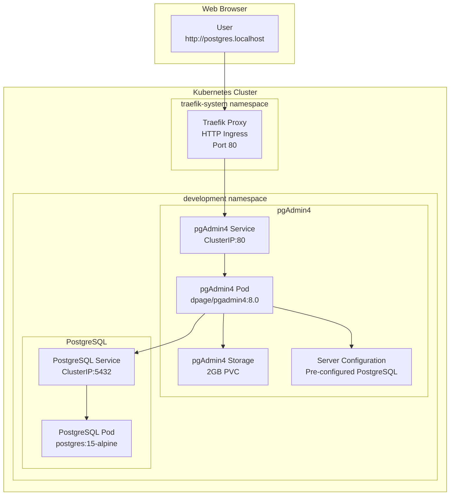

# pgAdmin4 Web Interface Setup and Usage

## 🎯 Overview

This session guides you through setting up and using pgAdmin4, a comprehensive web-based administration interface for PostgreSQL in your K3s development environment.

## 🏗️ Architecture



## ⚙️ Installation and Configuration

### Step 1: Deploy pgAdmin4

Create the pgAdmin4 deployment with the following configuration:

```yaml
apiVersion: v1
kind: ConfigMap
metadata:
  name: pgadmin-config
  namespace: development
data:
  servers.json: |
    {
      "Servers": {
        "1": {
          "Name": "Local PostgreSQL",
          "Group": "Servers",
          "Host": "postgres.development.svc.cluster.local",
          "Port": 5432,
          "MaintenanceDB": "devdb",
          "Username": "admin",
          "SSLMode": "prefer"
        }
      }
    }
---
apiVersion: apps/v1
kind: Deployment
metadata:
  name: pgadmin
  namespace: development
spec:
  replicas: 1
  selector:
    matchLabels:
      app: pgadmin
  template:
    metadata:
      labels:
        app: pgadmin
    spec:
      containers:
      - name: pgadmin
        image: dpage/pgadmin4:8.0
        env:
        - name: PGADMIN_DEFAULT_EMAIL
          value: "admin@localhost.local"
        - name: PGADMIN_DEFAULT_PASSWORD
          value: "1q2w3e4r@123"
        - name: PGADMIN_CONFIG_LOGIN_BANNER
          value: '"PostgreSQL Admin - K3s Development Environment"'
        - name: PGADMIN_CONFIG_ENHANCED_COOKIE_PROTECTION
          value: "True"
        - name: PGADMIN_LISTEN_PORT
          value: "80"
        ports:
        - name: http
          containerPort: 80
        volumeMounts:
        - name: pgadmin-storage
          mountPath: /var/lib/pgadmin
        - name: pgadmin-config
          mountPath: /pgadmin4/servers.json
          subPath: servers.json
          readOnly: true
        resources:
          requests:
            memory: "256Mi"
            cpu: "100m"
          limits:
            memory: "512Mi"
            cpu: "300m"
      volumes:
      - name: pgadmin-storage
        persistentVolumeClaim:
          claimName: pgadmin-pvc
      - name: pgadmin-config
        configMap:
          name: pgadmin-config
```

### Step 2: Create Service and Storage

```yaml
apiVersion: v1
kind: Service
metadata:
  name: pgadmin
  namespace: development
spec:
  type: ClusterIP
  ports:
  - port: 80
    targetPort: http
    name: http
  selector:
    app: pgadmin
---
apiVersion: v1
kind: PersistentVolumeClaim
metadata:
  name: pgadmin-pvc
  namespace: development
spec:
  accessModes:
    - ReadWriteOnce
  resources:
    requests:
      storage: 2Gi
```

### Step 3: Configure Traefik Ingress

```yaml
apiVersion: traefik.io/v1alpha1
kind: IngressRoute
metadata:
  name: pgadmin-ingress
  namespace: development
spec:
  entryPoints:
    - web
  routes:
  - match: Host(`postgres.localhost`)
    kind: Rule
    services:
    - name: pgadmin
      port: 80
```

### Step 4: Configure Hosts File

Add the following entry to your `/etc/hosts` file:

```bash
sudo bash -c 'echo "127.0.0.1 postgres.localhost" >> /etc/hosts'
```

## 🚀 Deployment

### Apply Configuration

```bash
# Deploy pgAdmin4
kubectl apply -f k8s-manifests/pgadmin.yaml

# Verify deployment
kubectl get pods -n development -l app=pgadmin
kubectl get svc -n development pgadmin
kubectl get ingressroute -n development pgadmin-ingress

# Check pgAdmin4 logs
kubectl logs -n development deployment/pgadmin -f
```

### Verify Installation

```bash
# Test HTTP connectivity
curl -I http://postgres.localhost

# Check if pgAdmin4 is accessible
echo "pgAdmin4 URL: http://postgres.localhost"
echo "Login: admin@localhost.local"
echo "Password: 1q2w3e4r@123"
```

## 🖥️ Using pgAdmin4

### Initial Login

1. **Open Web Browser**: Navigate to `http://postgres.localhost`
2. **Login Screen**: Enter credentials
   - Email: `admin@localhost.local`
   - Password: `1q2w3e4r@123`
3. **Dashboard**: You'll see the pgAdmin4 dashboard

### Connecting to PostgreSQL

1. **Server List**: In the left panel, you'll see "Local PostgreSQL" server
2. **Connect**: Right-click and select "Connect Server"
3. **Password**: Enter PostgreSQL password: `1q2w3e4r@123`
4. **Connected**: The server will expand showing databases, roles, etc.

### Database Operations

#### Creating a New Database

1. Right-click on "Databases" → "Create" → "Database..."
2. **General Tab**:
   - Database: `myapp_db`
   - Owner: `admin`
   - Comment: `Application database`
3. **Definition Tab**:
   - Encoding: `UTF8`
   - Template: `template1`
   - Collation: `C`
   - Character type: `C`
4. Click "Save"

#### Query Tool Usage

1. **Open Query Tool**: Right-click database → "Query Tool"
2. **Write SQL**: Enter your SQL commands
   ```sql
   -- Create a sample table
   CREATE TABLE users (
       id SERIAL PRIMARY KEY,
       name VARCHAR(100) NOT NULL,
       email VARCHAR(100) UNIQUE NOT NULL,
       created_at TIMESTAMP DEFAULT NOW()
   );
   
   -- Insert sample data
   INSERT INTO users (name, email) VALUES
   ('John Doe', 'john@example.com'),
   ('Jane Smith', 'jane@example.com');
   
   -- Query data
   SELECT * FROM users;
   ```
3. **Execute**: Click ▶️ or press F5
4. **Results**: View results in the output panel

#### User and Role Management

1. **Navigate**: Expand server → "Login/Group Roles"
2. **Create User**: Right-click → "Create" → "Login/Group Role..."
3. **General Tab**:
   - Name: `app_user`
   - Password: `secure_password`
4. **Privileges Tab**:
   - Can login: ✓
   - Superuser: ✗
   - Create roles: ✗
   - Create databases: ✗
5. **SQL Tab**: Review generated SQL
6. **Save**: Click "Save"

#### Backup and Restore

##### Creating a Backup

1. **Select Database**: Right-click on target database
2. **Backup**: Select "Backup..."
3. **General Tab**:
   - Filename: `devdb_backup_$(date).sql`
   - Format: `Plain`
   - Compression: `None`
4. **Dump Options Tab**:
   - Data: ✓
   - Blobs: ✓
   - Schema: ✓
5. **Objects Tab**: Select specific objects if needed
6. **Options Tab**: Configure additional options
7. **Backup**: Click "Backup"

##### Restoring from Backup

1. **Create Database**: Create target database first
2. **Restore**: Right-click database → "Restore..."
3. **General Tab**:
   - Format: `Custom or tar`
   - Filename: Select backup file
4. **Options Tab**:
   - Pre-data: ✓
   - Data: ✓
   - Post-data: ✓
5. **Restore**: Click "Restore"

#### Performance Monitoring

##### Dashboard View

1. **Select Database**: Click on database name
2. **Dashboard Tab**: View real-time statistics
   - Sessions
   - Transactions per second
   - Database size
   - Cache hit ratio

##### Query Performance

1. **Tools Menu**: Tools → "Query History"
2. **View History**: See all executed queries
3. **Performance**: View execution times and statistics

##### Server Activity

1. **Monitoring**: Tools → "Server Status"
2. **Active Queries**: View running queries
3. **Locks**: Monitor database locks
4. **Statistics**: Database and table statistics

## 📊 Advanced Features

### ERD (Entity Relationship Diagrams)

1. **Select Database**: Right-click database
2. **ERD Tool**: Tools → "ERD Tool"
3. **Add Tables**: Drag tables from browser to canvas
4. **Relationships**: View and edit relationships
5. **Export**: Save as image or SQL

### Query Profiling

1. **Query Tool**: Open query tool
2. **Explain Options**: Click "Explain Options"
3. **Run Explain**: Execute with EXPLAIN ANALYZE
4. **Visual Plan**: View graphical execution plan
5. **Performance**: Identify bottlenecks

### Data Import/Export

#### Import CSV Data

1. **Select Table**: Right-click table → "Import/Export Data..."
2. **Import Tab**: Select "Import"
3. **File Options**:
   - Filename: Select CSV file
   - Format: `csv`
   - Header: ✓ if CSV has headers
4. **Columns**: Map CSV columns to table columns
5. **Import**: Click "OK"

#### Export Table Data

1. **Select Table**: Right-click table → "Import/Export Data..."
2. **Export Tab**: Select "Export"
3. **File Options**:
   - Filename: `table_export.csv`
   - Format: `csv`
   - Header: ✓
4. **Columns**: Select columns to export
5. **Export**: Click "OK"

## 🔧 Configuration and Customization

### pgAdmin4 Preferences

1. **File Menu**: File → "Preferences"
2. **Browser**: Configure tree display options
3. **Query Tool**: Set default options for query tool
4. **Dashboards**: Customize dashboard refresh rates
5. **Miscellaneous**: Other UI preferences

### Server Configuration

#### Adding Additional Servers

1. **Object Browser**: Right-click "Servers"
2. **Create Server**: Select "Create" → "Server..."
3. **General Tab**:
   - Name: `Production PostgreSQL`
   - Server group: `Servers`
4. **Connection Tab**:
   - Host: `production-db.example.com`
   - Port: `5432`
   - Database: `postgres`
   - Username: `readonly_user`
5. **Advanced Tab**: Configure connection options
6. **Save**: Click "Save"

#### Connection Pooling

1. **Server Properties**: Right-click server → "Properties"
2. **Advanced Tab**:
   - Connection limit: `10`
   - Auto connect: ✓
   - Connect timeout: `30`
3. **SSL Tab**: Configure SSL settings if needed

### Security Configuration

#### User Access Control

1. **pgAdmin Users**: File → "Preferences" → "User Management"
2. **Add User**: Create additional pgAdmin users
3. **Roles**: Assign different access levels
4. **Two-Factor**: Enable 2FA for enhanced security

## 🐛 Troubleshooting

### Common Issues

#### 1. Cannot Access pgAdmin4 Web Interface

```bash
# Check pod status
kubectl get pods -n development -l app=pgadmin

# Check service
kubectl get svc -n development pgadmin

# Check ingress
kubectl get ingressroute -n development pgadmin-ingress

# Check logs
kubectl logs -n development deployment/pgadmin

# Test connectivity
curl -v http://postgres.localhost
```

#### 2. PostgreSQL Connection Failed

```bash
# Test network connectivity
kubectl exec -it -n development deployment/pgadmin -- ping postgres.development.svc.cluster.local

# Test PostgreSQL port
kubectl exec -it -n development deployment/pgadmin -- nc -zv postgres.development.svc.cluster.local 5432

# Verify PostgreSQL credentials
kubectl exec -it -n development deployment/postgres -- psql -U admin -d devdb -c "SELECT current_user;"
```

#### 3. Performance Issues

```bash
# Check resource usage
kubectl top pod -n development -l app=pgadmin

# Increase resources if needed
kubectl patch deployment pgadmin -n development -p '{
  "spec": {
    "template": {
      "spec": {
        "containers": [{
          "name": "pgadmin",
          "resources": {
            "limits": {
              "memory": "1Gi",
              "cpu": "500m"
            },
            "requests": {
              "memory": "512Mi",
              "cpu": "200m"
            }
          }
        }]
      }
    }
  }
}'
```

#### 4. Lost Configuration or Data

```bash
# Check PVC status
kubectl get pvc -n development pgadmin-pvc

# Recreate PVC if corrupted
kubectl delete pvc -n development pgadmin-pvc
kubectl apply -f k8s-manifests/pgadmin.yaml

# Restart deployment
kubectl rollout restart deployment/pgadmin -n development
```

### Maintenance Tasks

#### Backup pgAdmin4 Configuration

```bash
# Create backup of pgAdmin4 data
kubectl exec -n development deployment/pgadmin -- tar -czf /tmp/pgadmin-backup.tar.gz /var/lib/pgadmin

# Copy backup to local machine
kubectl cp development/$(kubectl get pod -n development -l app=pgadmin -o jsonpath='{.items[0].metadata.name}'):/tmp/pgadmin-backup.tar.gz ./pgadmin-backup.tar.gz
```

#### Update pgAdmin4

```bash
# Update image version
kubectl patch deployment pgadmin -n development -p '{
  "spec": {
    "template": {
      "spec": {
        "containers": [{
          "name": "pgadmin",
          "image": "dpage/pgadmin4:8.1"
        }]
      }
    }
  }
}'

# Check rollout status
kubectl rollout status deployment/pgadmin -n development
```

## 📈 Monitoring and Logging

### Application Logs

```bash
# View pgAdmin4 logs
kubectl logs -n development deployment/pgadmin -f

# Filter for errors
kubectl logs -n development deployment/pgadmin | grep -i error

# Check startup logs
kubectl logs -n development deployment/pgadmin --since=5m
```

### Resource Monitoring

```bash
# Check resource usage
kubectl top pod -n development -l app=pgadmin

# Monitor over time
watch kubectl top pod -n development -l app=pgadmin

# Check node resource usage
kubectl describe node | grep -A 5 "Allocated resources"
```

### Performance Metrics

```bash
# Query execution statistics (from pgAdmin4 query history)
# Available through pgAdmin4 web interface:
# Tools → Query History → Statistics

# Database connection statistics
# Available through pgAdmin4 dashboard:
# Dashboard → Server Activity → Statistics
```

## 🎉 Success Criteria

You have successfully set up and configured pgAdmin4 when:

1. ✅ pgAdmin4 is accessible at `http://postgres.localhost`
2. ✅ Login works with `admin@localhost.local` / `1q2w3e4r@123`
3. ✅ PostgreSQL server connection is pre-configured and working
4. ✅ Query tool allows running SQL commands successfully
5. ✅ Database objects are browsable in the tree view
6. ✅ Backup and restore operations work correctly
7. ✅ Dashboard shows real-time database statistics

## 📚 Related Documentation

- [PostgreSQL Main Documentation](../README.md)
- [PostgreSQL TCP Ingress Setup](./traefik-tcp-ingress.md)
- [Database Administration Guide](./database-administration.md)
- [Application Integration Guide](./application-integration.md)
- [pgAdmin4 Official Documentation](https://www.pgadmin.org/docs/)

## 🔗 Useful Links

- [pgAdmin4 Docker Hub](https://hub.docker.com/r/dpage/pgadmin4)
- [pgAdmin4 Configuration Reference](https://www.pgadmin.org/docs/pgadmin4/latest/config_py.html)
- [PostgreSQL Documentation](https://www.postgresql.org/docs/)
- [Traefik IngressRoute Documentation](https://doc.traefik.io/traefik/routing/providers/kubernetes-crd/)
