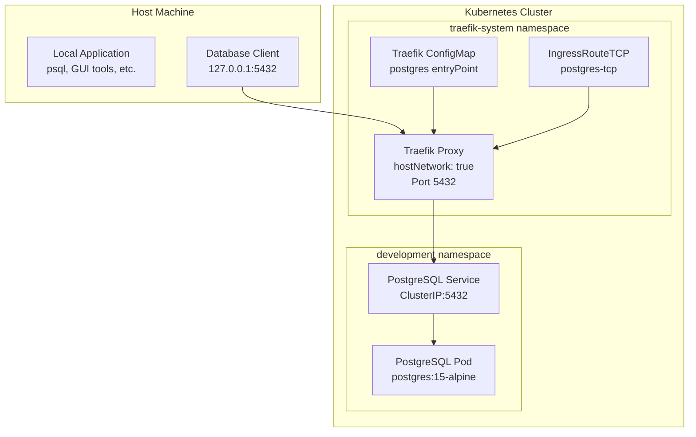

# PostgreSQL Traefik TCP Ingress Configuration

## 🎯 Overview

This session guides you through configuring Traefik to expose PostgreSQL via TCP Ingress, enabling direct database connections from your host machine without using `kubectl port-forward`.

## 🏗️ Architecture



## ⚙️ Configuration Steps

### Step 1: Update Traefik Configuration

Add the PostgreSQL entryPoint to Traefik's configuration:

```yaml
# In traefik.yml ConfigMap
entryPoints:
  web:
    address: ":80"
  websecure:
    address: ":443"
  traefik:
    address: ":8080"
  postgres:                    # Add this entryPoint
    address: ":5432"
```

### Step 2: Update Traefik Deployment

Add the PostgreSQL port to the Traefik container:

```yaml
# In Traefik Deployment
ports:
- name: web
  containerPort: 80
- name: websecure
  containerPort: 443
- name: admin
  containerPort: 8080
- name: postgres              # Add this port
  containerPort: 5432
```

### Step 3: Update Traefik Service

Expose the PostgreSQL port in the Traefik service:

```yaml
# In Traefik Service
ports:
- name: web
  port: 80
  targetPort: 80
  nodePort: 30080
- name: websecure
  port: 443
  targetPort: 443
  nodePort: 30443
- name: admin
  port: 8080
  targetPort: 8080
  nodePort: 30808
- name: postgres              # Add this port
  port: 5432
  targetPort: 5432
  nodePort: 30432
```

### Step 4: Create IngressRouteTCP

Create the TCP routing configuration:

```yaml
apiVersion: traefik.io/v1alpha1
kind: IngressRouteTCP
metadata:
  name: postgres-tcp
  namespace: development
spec:
  entryPoints:
    - postgres
  routes:
  - match: HostSNI(`*`)
    services:
    - name: postgres
      port: 5432
```

## 🚀 Implementation

### Apply Configuration

```bash
# Apply the updated Traefik configuration
kubectl apply -f k8s-manifests/traefik.yaml

# Verify Traefik pod restart
kubectl get pods -n traefik-system

# Check IngressRouteTCP creation
kubectl get ingressroutetcp -n development

# Verify service ports
kubectl get svc -n traefik-system traefik -o yaml
```

### Verify Connectivity

```bash
# Test TCP connectivity
nc -zv 127.0.0.1 5432

# Test with telnet
telnet 127.0.0.1 5432

# Test PostgreSQL connection (requires psql)
PGPASSWORD=1q2w3e4r@123 psql -h 127.0.0.1 -p 5432 -U admin -d devdb -c "SELECT version();"
```

## 📋 Testing Checklist

### ✅ Pre-requisites
- [ ] K3s cluster is running
- [ ] Traefik is deployed and running
- [ ] PostgreSQL is deployed in `development` namespace
- [ ] PostgreSQL service is accessible within cluster

### ✅ Configuration
- [ ] Traefik ConfigMap updated with `postgres` entryPoint
- [ ] Traefik Deployment updated with port 5432
- [ ] Traefik Service updated with PostgreSQL port
- [ ] IngressRouteTCP created in `development` namespace

### ✅ Verification
- [ ] Traefik pod restarted successfully
- [ ] IngressRouteTCP resource exists
- [ ] TCP connectivity test passes (`nc -zv 127.0.0.1 5432`)
- [ ] PostgreSQL connection test passes
- [ ] CRUD operations work correctly

## 🐛 Troubleshooting

### Traefik Pod Issues

```bash
# Check if new pod is running
kubectl get pods -n traefik-system

# If pod is pending due to port conflict
kubectl delete pod -n traefik-system <old-traefik-pod>

# Check pod logs
kubectl logs -n traefik-system deployment/traefik
```

### IngressRouteTCP Issues

```bash
# Verify IngressRouteTCP exists
kubectl get ingressroutetcp -n development postgres-tcp

# Check resource details
kubectl describe ingressroutetcp -n development postgres-tcp

# Verify namespace permissions
kubectl get rolebindings -n development
```

### Connection Issues

```bash
# Check if port is listening
ss -tlnp | grep 5432
netstat -tlnp | grep 5432

# Test different connection methods
nc -zv 127.0.0.1 5432
telnet 127.0.0.1 5432
nmap -p 5432 127.0.0.1

# Check PostgreSQL service in cluster
kubectl get svc -n development postgres
kubectl get endpoints -n development postgres
```

### Network Connectivity

```bash
# Test from inside cluster
kubectl run test-connection --rm -it --image=postgres:15-alpine -- psql -h postgres.development.svc.cluster.local -U admin -d devdb

# Check iptables rules (on host)
sudo iptables -L -n | grep 5432

# Check if k3s is using different interface
ip addr show
```

## 📊 Performance Considerations

### Connection Pooling

Since connections now bypass `kubectl port-forward`, consider connection pooling:

```javascript
// Node.js example with connection pooling
const { Pool } = require('pg');

const pool = new Pool({
  host: '127.0.0.1',
  port: 5432,
  database: 'devdb',
  user: 'admin',
  password: '1q2w3e4r@123',
  max: 10,                    // Maximum pool size
  idleTimeoutMillis: 30000,   // Close idle connections after 30s
  connectionTimeoutMillis: 2000,
});
```

### Resource Monitoring

```bash
# Monitor connection count
PGPASSWORD=1q2w3e4r@123 psql -h 127.0.0.1 -p 5432 -U admin -d devdb -c "
SELECT 
    datname,
    count(*) as connections,
    max(state) as max_state
FROM pg_stat_activity 
GROUP BY datname;"

# Monitor Traefik resource usage
kubectl top pod -n traefik-system

# Monitor PostgreSQL resource usage
kubectl top pod -n development -l app=postgres
```

## 🔧 Advanced Configuration

### SSL/TLS Support

For production, consider adding SSL support:

```yaml
# IngressRouteTCP with TLS
apiVersion: traefik.io/v1alpha1
kind: IngressRouteTCP
metadata:
  name: postgres-tcp-tls
  namespace: development
spec:
  entryPoints:
    - postgres
  routes:
  - match: HostSNI(`postgres.local`)
    services:
    - name: postgres
      port: 5432
  tls:
    secretName: postgres-tls-secret
```

### Connection Limits

Configure connection limits in PostgreSQL:

```sql
-- Check current settings
SHOW max_connections;
SHOW shared_buffers;

-- Monitor connections
SELECT 
    pid,
    datname,
    usename,
    application_name,
    client_addr,
    state,
    query_start
FROM pg_stat_activity
WHERE state = 'active';
```

## 📈 Monitoring and Observability

### Traefik Metrics

```bash
# Access Traefik dashboard
kubectl port-forward -n traefik-system svc/traefik 8080:8080

# Visit http://localhost:8080 for dashboard
```

### PostgreSQL Metrics

```sql
-- Connection statistics
SELECT 
    datname,
    numbackends,
    xact_commit,
    xact_rollback,
    blks_read,
    blks_hit,
    tup_returned,
    tup_fetched,
    tup_inserted,
    tup_updated,
    tup_deleted
FROM pg_stat_database
WHERE datname = 'devdb';

-- Long running queries
SELECT 
    pid,
    now() - pg_stat_activity.query_start AS duration,
    query,
    state
FROM pg_stat_activity 
WHERE (now() - pg_stat_activity.query_start) > interval '5 minutes';
```

## 🎉 Success Criteria

You have successfully configured Traefik TCP Ingress for PostgreSQL when:

1. ✅ You can connect using: `psql -h 127.0.0.1 -p 5432 -U admin -d devdb`
2. ✅ No `kubectl port-forward` is required
3. ✅ Database operations (SELECT, INSERT, UPDATE, DELETE) work correctly
4. ✅ Multiple concurrent connections work properly
5. ✅ Connection performance is adequate for development needs

## 📚 Related Documentation

- [PostgreSQL Main Documentation](../README.md)
- [Traefik Documentation](../../traefik/README.md)
- [Getting Started Guide](../../getting-started/README.md)
- [PostgreSQL Quick Start](./quick-start.md)
