# Prometheus Monitoring Documentation

Prometheus provides comprehensive monitoring and alerting for the Kubernetes development environment, collecting metrics from all infrastructure components and applications.

## 📋 Overview

Prometheus serves as the central monitoring system, offering:

- **Metrics Collection**: Time-series data gathering from multiple sources
- **Service Discovery**: Automatic target discovery for Docker containers
- **Alerting**: Rule-based alerting capabilities
- **Query Language**: PromQL for flexible data analysis
- **Storage**: Efficient time-series database with configurable retention
- **Integration**: Native integration with Grafana and other tools

## 🏗️ Architecture

```mermaid
graph TB
    subgraph "Prometheus - prometheus:9090"
        subgraph "Core Components"
            PROM_SERVER[Prometheus Server<br/>TSDB + Query Engine]
            CONFIG[Configuration<br/>prometheus.yml]
            RULES[Alert Rules<br/>*.rules.yml]
            WEB_UI[Web UI<br/>:9090]
        end
        
        subgraph "Service Discovery"
            DOCKER_SD[Docker SD<br/>Container Discovery]
            STATIC_SD[Static SD<br/>Fixed Targets]
            FILE_SD[File SD<br/>Dynamic Targets]
        end
        
        subgraph "Storage"
            TSDB[Time Series DB<br/>Local Storage]
            RETENTION[Retention Policy<br/>30 days default]
            COMPACTION[Data Compaction<br/>Background Process]
        end
    end
    
    subgraph "Metric Sources"
        subgraph "Infrastructure"
            K3S_METRICS[K3s Cluster<br/>kubelet, kube-proxy]
            TRAEFIK_METRICS[Traefik<br/>HTTP metrics]
            RANCHER_METRICS[Rancher<br/>Management metrics]
        end
        
        subgraph "System Metrics"
            NODE_EXPORTER[Node Exporter<br/>System metrics]
            CADVISOR[cAdvisor<br/>Container metrics]
            DOCKER_METRICS[Docker Engine<br/>Container stats]
        end
        
        subgraph "Application Metrics"
            APP_METRICS[Application<br/>Custom metrics]
            JMX_METRICS[JMX Exporter<br/>Java applications]
            CUSTOM_EXPORTERS[Custom Exporters<br/>Database, etc.]
        end
    end
    
    subgraph "Consumers"
        GRAFANA[Grafana<br/>Visualization]
        ALERTMANAGER[Alertmanager<br/>Alert routing]
        API_CLIENTS[API Clients<br/>External systems]
    end
    
    K8S_SD --> PROM_SERVER
    DOCKER_SD --> PROM_SERVER
    STATIC_SD --> PROM_SERVER
    FILE_SD --> PROM_SERVER
    
    K3S_METRICS --> PROM_SERVER
    TRAEFIK_METRICS --> PROM_SERVER
    RANCHER_METRICS --> PROM_SERVER
    NODE_EXPORTER --> PROM_SERVER
    CADVISOR --> PROM_SERVER
    DOCKER_METRICS --> PROM_SERVER
    APP_METRICS --> PROM_SERVER
    JMX_METRICS --> PROM_SERVER
    CUSTOM_EXPORTERS --> PROM_SERVER
    
    PROM_SERVER --> GRAFANA
    PROM_SERVER --> ALERTMANAGER
    PROM_SERVER --> API_CLIENTS
    
    CONFIG --> PROM_SERVER
    RULES --> PROM_SERVER
    PROM_SERVER --> TSDB
    TSDB --> RETENTION
    TSDB --> COMPACTION
```



## 🚀 Access and Configuration

### Prometheus Web UI

- **URL**: http://prometheus.dev:9090
- **Features**: Query interface, target status, configuration, alerts
- **Authentication**: None (internal development environment)

### Key Endpoints

| Endpoint | Purpose |
|----------|---------|
| `/` | Web UI dashboard |
| `/graph` | Query interface |
| `/targets` | Scrape target status |
| `/config` | Current configuration |
| `/rules` | Alert rules |
| `/alerts` | Active alerts |
| `/metrics` | Prometheus self-metrics |
| `/api/v1/query` | Query API |

## 🔧 Configuration

### Main Configuration File

```yaml
# monitoring/prometheus/prometheus.yml
global:
  scrape_interval: 15s
  evaluation_interval: 15s
  external_labels:
    cluster: 'dev-cluster'
    environment: 'development'

rule_files:
  - "rules/*.yml"

alerting:
  alertmanagers:
    - static_configs:
        - targets:
          - alertmanager:9093

scrape_configs:
  # Prometheus self-monitoring
  - job_name: 'prometheus'
    static_configs:
      - targets: ['localhost:9090']
    scrape_interval: 5s

  # K3s cluster components
  - job_name: 'k3s-server'
    static_configs:
      - targets: ['k3s-server:10250']
    scrape_interval: 10s
    metrics_path: /metrics

  - job_name: 'k3s-agents'
    static_configs:
      - targets: 
        - 'k3s-agent-1:10250'
        - 'k3s-agent-2:10250'
    scrape_interval: 10s
    metrics_path: /metrics

  # Infrastructure services
  - job_name: 'traefik'
    static_configs:
      - targets: ['traefik:8080']
    scrape_interval: 10s
    metrics_path: /metrics

  - job_name: 'rancher'
    static_configs:
      - targets: ['rancher:443']
    scrape_interval: 30s
    metrics_path: /metrics
    scheme: https
    tls_config:
      insecure_skip_verify: true

  - job_name: 'grafana'
    static_configs:
      - targets: ['grafana:3000']
    scrape_interval: 30s
    metrics_path: /metrics

  # Docker container discovery
  - job_name: 'docker-containers'
    docker_sd_configs:
      - host: unix:///var/run/docker.sock
        refresh_interval: 5s
    relabel_configs:
      - source_labels: [__meta_docker_container_label_dev_service_type]
        action: keep
        regex: .+
      - source_labels: [__meta_docker_container_label_dev_service_name]
        target_label: service_name
      - source_labels: [__meta_docker_container_label_dev_service_type]
        target_label: service_type

  # Kubernetes service discovery
  - job_name: 'kubernetes-apiservers'
    kubernetes_sd_configs:
      - role: endpoints
        kubeconfig_file: /etc/kubeconfig/kubeconfig.yaml
    scheme: https
    tls_config:
      ca_file: /var/run/secrets/kubernetes.io/serviceaccount/ca.crt
      insecure_skip_verify: true
    relabel_configs:
      - source_labels: [__meta_kubernetes_namespace, __meta_kubernetes_service_name, __meta_kubernetes_endpoint_port_name]
        action: keep
        regex: default;kubernetes;https

  - job_name: 'kubernetes-nodes'
    kubernetes_sd_configs:
      - role: node
        kubeconfig_file: /etc/kubeconfig/kubeconfig.yaml
    scheme: https
    tls_config:
      ca_file: /var/run/secrets/kubernetes.io/serviceaccount/ca.crt
      insecure_skip_verify: true
    relabel_configs:
      - action: labelmap
        regex: __meta_kubernetes_node_label_(.+)

  - job_name: 'kubernetes-pods'
    kubernetes_sd_configs:
      - role: pod
        kubeconfig_file: /etc/kubeconfig/kubeconfig.yaml
    relabel_configs:
      - source_labels: [__meta_kubernetes_pod_annotation_prometheus_io_scrape]
        action: keep
        regex: true
      - source_labels: [__meta_kubernetes_pod_annotation_prometheus_io_path]
        action: replace
        target_label: __metrics_path__
        regex: (.+)
      - source_labels: [__address__, __meta_kubernetes_pod_annotation_prometheus_io_port]
        action: replace
        regex: ([^:]+)(?::\d+)?;(\d+)
        replacement: $1:$2
        target_label: __address__
```

### Environment Variables

```bash
# Prometheus Configuration
PROMETHEUS_RETENTION=30d
PROMETHEUS_HOST=prometheus.dev
PROMETHEUS_STORAGE_PATH=/prometheus
PROMETHEUS_CONFIG_PATH=/etc/prometheus
```

### Kubernetes Configuration

```yaml
prometheus:
  image: prom/prometheus:v2.56.1
  command:
    - --config.file=/etc/prometheus/conf/prometheus.yml
    - --storage.tsdb.path=/prometheus
    - --storage.tsdb.retention.time=${PROMETHEUS_RETENTION:-30d}
    - --web.enable-lifecycle
    - --web.enable-admin-api
    - --web.enable-remote-write-receiver
    - --enable-feature=exemplar-storage
  ports:
    - "9090:9090"
  networks:
    dev-cluster:
      ipv4_address: 172.30.30.10
  volumes:
    - prometheus-data:/prometheus
    - prometheus-config:/etc/prometheus
    - ./monitoring/prometheus:/etc/prometheus/conf
```

## 📊 Metrics Collection

### Infrastructure Metrics

#### K3s Cluster Metrics

```promql
# Node resource usage
node_cpu_seconds_total
node_memory_MemAvailable_bytes
node_filesystem_free_bytes

# Container metrics
container_cpu_usage_seconds_total
container_memory_usage_bytes
container_network_receive_bytes_total
container_network_transmit_bytes_total

# Kubernetes metrics
kube_node_status_condition
kube_pod_status_phase
kube_deployment_status_replicas
kube_service_status_load_balancer_ingress
```

#### Traefik Metrics

```promql
# Request metrics
traefik_http_requests_total
traefik_http_request_duration_seconds
traefik_http_responses_total

# Service health
traefik_service_open_connections
traefik_service_requests_total
traefik_service_request_duration_seconds
```

#### Rancher Metrics

```promql
# Cluster management
rancher_cluster_cpu_utilization
rancher_cluster_memory_utilization
rancher_project_count
rancher_workload_count
```

### Application Metrics

#### Custom Application Metrics

```yaml
# Application with Prometheus metrics
apiVersion: apps/v1
kind: Deployment
metadata:
  name: sample-app
spec:
  template:
    metadata:
      annotations:
        prometheus.io/scrape: "true"
        prometheus.io/port: "8080"
        prometheus.io/path: "/metrics"
    spec:
      containers:
      - name: app
        image: sample-app:latest
        ports:
        - containerPort: 8080
          name: metrics
```

#### Metrics Exposition Format

```
# HELP http_requests_total The total number of HTTP requests
# TYPE http_requests_total counter
http_requests_total{method="GET",handler="/api/users"} 1027
http_requests_total{method="POST",handler="/api/users"} 3

# HELP http_request_duration_seconds HTTP request latency
# TYPE http_request_duration_seconds histogram
http_request_duration_seconds_bucket{le="0.1"} 24054
http_request_duration_seconds_bucket{le="0.2"} 33444
http_request_duration_seconds_bucket{le="0.5"} 100392
http_request_duration_seconds_bucket{le="+Inf"} 144320
http_request_duration_seconds_sum 53423
http_request_duration_seconds_count 144320
```

## 🔍 PromQL Queries

### Basic Queries

```promql
# Current CPU usage per container
rate(container_cpu_usage_seconds_total[5m]) * 100

# Memory usage by container
container_memory_usage_bytes / container_spec_memory_limit_bytes * 100

# HTTP request rate
rate(traefik_http_requests_total[5m])

# 95th percentile response time
histogram_quantile(0.95, rate(http_request_duration_seconds_bucket[5m]))
```

### Advanced Queries

```promql
# Pods with high CPU usage
topk(10, 
  rate(container_cpu_usage_seconds_total{name!=""}[5m]) * 100
)

# Network I/O per node
sum by (instance) (
  rate(node_network_receive_bytes_total[5m]) + 
  rate(node_network_transmit_bytes_total[5m])
)

# Alert: High error rate
(
  rate(traefik_http_responses_total{code=~"5.."}[5m]) / 
  rate(traefik_http_responses_total[5m])
) > 0.05

# Disk usage prediction
predict_linear(
  node_filesystem_free_bytes{fstype!="tmpfs"}[1h], 4*3600
) < 0
```

### Aggregation Functions

```promql
# Sum across all instances
sum(rate(http_requests_total[5m])) by (handler)

# Average response time
avg(http_request_duration_seconds) by (service)

# Maximum memory usage
max(container_memory_usage_bytes) by (pod)

# 95th percentile
quantile(0.95, http_request_duration_seconds)
```

## 🚨 Alerting Rules

### Alert Rule Configuration

```yaml
# monitoring/prometheus/rules/alerts.yml
groups:
- name: infrastructure
  rules:
  - alert: HighCPUUsage
    expr: rate(container_cpu_usage_seconds_total[5m]) * 100 > 80
    for: 5m
    labels:
      severity: warning
    annotations:
      summary: High CPU usage detected
      description: "Container {{ $labels.name }} CPU usage is above 80%"

  - alert: HighMemoryUsage
    expr: (container_memory_usage_bytes / container_spec_memory_limit_bytes) * 100 > 90
    for: 2m
    labels:
      severity: critical
    annotations:
      summary: High memory usage detected
      description: "Container {{ $labels.name }} memory usage is above 90%"

  - alert: DiskSpaceLow
    expr: (node_filesystem_free_bytes / node_filesystem_size_bytes) * 100 < 10
    for: 1m
    labels:
      severity: critical
    annotations:
      summary: Low disk space
      description: "Disk space on {{ $labels.instance }} is below 10%"

- name: application
  rules:
  - alert: HighErrorRate
    expr: |
      (
        rate(traefik_http_responses_total{code=~"5.."}[5m]) / 
        rate(traefik_http_responses_total[5m])
      ) > 0.05
    for: 2m
    labels:
      severity: warning
    annotations:
      summary: High error rate detected
      description: "Error rate is above 5% for service {{ $labels.service }}"

  - alert: ServiceDown
    expr: up == 0
    for: 1m
    labels:
      severity: critical
    annotations:
      summary: Service is down
      description: "Service {{ $labels.job }} is down"
```

### Alert Severity Levels

| Severity | Description | Response Time |
|----------|-------------|---------------|
| `info` | Informational alerts | No immediate action |
| `warning` | Potential issues | Review within hours |
| `critical` | Immediate attention required | Response within minutes |
| `emergency` | System-wide impact | Immediate response |

## 📈 Performance Optimization

### Storage Optimization

```yaml
# Prometheus storage configuration
command:
  - --storage.tsdb.retention.time=30d
  - --storage.tsdb.retention.size=50GB
  - --storage.tsdb.min-block-duration=2h
  - --storage.tsdb.max-block-duration=25h
  - --storage.tsdb.wal-compression
```

### Memory Management

```yaml
# Resource limits
prometheus:
  deploy:
    resources:
      limits:
        cpu: "2"
        memory: "4Gi"
      requests:
        cpu: "1"
        memory: "2Gi"
```

### Query Optimization

```promql
# Use recording rules for expensive queries
groups:
- name: recording_rules
  interval: 30s
  rules:
  - record: cluster:cpu_usage:rate5m
    expr: sum(rate(container_cpu_usage_seconds_total[5m])) by (cluster)

  - record: cluster:memory_usage:bytes
    expr: sum(container_memory_usage_bytes) by (cluster)
```

## 🔧 Advanced Configuration

### Remote Write

```yaml
# Remote write configuration
remote_write:
  - url: https://prometheus-remote-write.example.com/api/v1/write
    basic_auth:
      username: user
      password: pass
    write_relabel_configs:
      - source_labels: [__name__]
        regex: 'expensive_metric.*'
        action: drop
```

### External Labels

```yaml
# Global external labels
global:
  external_labels:
    cluster: 'k3s-dev'
    environment: 'development'
    region: 'local'
    datacenter: 'docker'
```

### Relabeling

```yaml
# Relabeling configuration
scrape_configs:
- job_name: 'kubernetes-pods'
  relabel_configs:
    # Keep only pods with scrape annotation
    - source_labels: [__meta_kubernetes_pod_annotation_prometheus_io_scrape]
      action: keep
      regex: true
    
    # Extract custom port
    - source_labels: [__meta_kubernetes_pod_annotation_prometheus_io_port]
      action: replace
      target_label: __address__
      regex: (.+)
      replacement: ${1}:${__meta_kubernetes_pod_annotation_prometheus_io_port}
    
    # Add custom labels
    - source_labels: [__meta_kubernetes_pod_label_app]
      target_label: application
    
    - source_labels: [__meta_kubernetes_pod_label_version]
      target_label: version
```

## 🛠️ Troubleshooting

### Common Issues

#### High Memory Usage

```bash
# Check memory usage
./k3s-helper.sh logs prometheus | grep -i "out of memory"

# Analyze TSDB size
docker exec prometheus du -sh /prometheus

# Check query performance
curl -s "http://prometheus.dev:9090/api/v1/query?query=prometheus_tsdb_symbol_table_size_bytes"
```

#### Slow Queries

```bash
# Check slow queries
curl -s "http://prometheus.dev:9090/api/v1/status/tsdb" | jq '.data'

# Monitor query duration
curl -s "http://prometheus.dev:9090/metrics" | grep prometheus_engine_query_duration_seconds
```

#### Scrape Failures

```bash
# Check target health
curl -s "http://prometheus.dev:9090/api/v1/targets" | jq '.data.activeTargets[] | select(.health != "up")'

# Verify connectivity
docker exec prometheus telnet k3s-server 10250
```

### Performance Tuning

#### Query Optimization

```promql
# Avoid high cardinality labels
# Bad: rate(http_requests_total{user_id="12345"}[5m])
# Good: rate(http_requests_total[5m]) and on() group_left() user_active_sessions{user_id="12345"}

# Use recording rules for complex queries
# Instead of: sum(rate(http_requests_total[5m])) by (service, method)
# Create: service_method:http_requests:rate5m

# Limit time ranges
# Bad: http_requests_total[1d]
# Good: http_requests_total[5m]
```

#### Storage Optimization

```bash
# Cleanup old data
docker exec prometheus promtool tsdb analyze /prometheus

# Compact blocks
docker exec prometheus promtool tsdb create-blocks-from openmetrics /path/to/data
```

## 📚 Best Practices

### Configuration Management

1. **Version Control**: Store all configurations in Git
2. **Environment Separation**: Use different configs per environment
3. **Validation**: Validate configs before deployment
4. **Documentation**: Document all custom metrics and rules
5. **Backup**: Regular backup of configuration and data

### Metrics Design

1. **Naming Convention**: Use consistent metric naming
2. **Label Strategy**: Avoid high cardinality labels
3. **Metric Types**: Choose appropriate metric types
4. **Documentation**: Document all custom metrics
5. **Lifecycle**: Plan metric lifecycle and deprecation

### Alerting Strategy

1. **Severity Levels**: Use consistent severity classification
2. **Alert Fatigue**: Avoid too many noisy alerts
3. **Runbooks**: Create runbooks for all critical alerts
4. **Testing**: Test alert rules and delivery
5. **Review**: Regular review and tuning of alerts

## 📖 Additional Resources

- [Prometheus Documentation](https://prometheus.io/docs/)
- [PromQL Guide](https://prometheus.io/docs/prometheus/latest/querying/basics/)
- [Best Practices](https://prometheus.io/docs/practices/)
- [Exporters](https://prometheus.io/docs/instrumenting/exporters/)
- [Recording Rules](https://prometheus.io/docs/prometheus/latest/configuration/recording_rules/)

For specific query examples and dashboard configurations, check the `examples/prometheus/` directory.
