# 🐄 Rancher - Kubernetes Management Platform

## 📊 Overview

Rancher is a complete Kubernetes management platform that provides a user-friendly interface for managing Kubernetes clusters and applications. It's deployed in our K3s development environment with HTTPS-first configuration and proper ingress routing through Traefik.

## 🏗️ Architecture

```mermaid
graph TB
    subgraph "Rancher Management"
        subgraph "Kubernetes Cluster"
            K3S[K3s Cluster<br/>Lightweight Kubernetes]
            WORKLOADS[Application Workloads<br/>Pods, Services, Ingress]
        end
        
        subgraph "Rancher Server"
            UI[Web Interface<br/>HTTPS]
            MGMT[Cluster Management<br/>Deploy/Scale/Update]
            MONITOR[Resource Monitoring<br/>CPU/Memory/Network]
            LOGS[Log Aggregation<br/>Pod Logs]
        end
        
        subgraph "Access Points"
            DOMAIN[https://rancher.localhost]
            PORT_FWD[https://localhost:8443]
            KUBECTL[kubectl CLI<br/>Direct Cluster Access]
        end
        
        subgraph "Ingress"
            TRAEFIK[Traefik<br/>Load Balancer]
            HTTP_REDIRECT[HTTP → HTTPS Redirect]
            TLS_PASSTHROUGH[TLS Passthrough]
        end
    end
```



## 🚀 Quick Start

### 1. Access Rancher

**Primary Access (Domain-based):**
- **URL**: https://rancher.localhost
- **Requirements**: Run `./scripts/setup-hosts.sh` first
- **Certificate**: Accept self-signed certificate warning

**Alternative Access (Port Forwarding):**
- **URL**: https://localhost:8443
- **Requirements**: Run `./scripts/setup-port-forwards.sh` first

### 2. Login Credentials
- **Username**: `admin`
- **Password**: `admin123`
- **Bootstrap**: Automatically configured

### 3. Initial Configuration
1. Open Rancher in your browser
2. Accept the self-signed certificate warning
3. Login with admin/admin123
4. The local K3s cluster should be automatically detected## ⚙️ Configuration

### Current Deployment Configuration

Rancher is deployed with the following key configuration preferences:

#### Environment Variables
```yaml
env:
- name: CATTLE_BOOTSTRAP_PASSWORD
  value: "admin123"                      # Pre-configured admin password
- name: CATTLE_SERVER_URL
  value: "https://rancher.localhost"     # HTTPS-first configuration
- name: CATTLE_SYSTEM_DEFAULT_REGISTRY
  value: ""                              # Use Docker Hub
- name: CATTLE_SYSTEM_CATALOG
  value: "bundled"                       # Include bundled apps
- name: CATTLE_TLS_MIN_VERSION
  value: ""                              # Default TLS settings
- name: CATTLE_AGENT_IMAGE
  value: "rancher/rancher-agent:v2.8.2"  # Agent version match
```

#### Key Configuration Preferences

1. **HTTPS-First Design**
   - `CATTLE_SERVER_URL` set to `https://rancher.localhost`
   - Forces all agent connections to use HTTPS
   - Ensures secure cluster management

2. **Automatic Bootstrap**
   - Pre-configured admin password for development
   - No manual setup wizard required
   - Immediate cluster access

3. **Self-Signed Certificate Support**
   - TLS secret with development certificate
   - Passthrough mode for Traefik ingress
   - Browser warning expected (development only)

### Kubernetes Deployment

```yaml
apiVersion: apps/v1
kind: Deployment
metadata:
  name: rancher
  namespace: cattle-system
spec:
  replicas: 1
  selector:
    matchLabels:
      app: rancher
  template:
    metadata:
      labels:
        app: rancher
    spec:
      serviceAccountName: rancher
      containers:
      - name: rancher
        image: rancher/rancher:v2.8.2
        ports:
        - containerPort: 80
        - containerPort: 443
        env:
        - name: CATTLE_BOOTSTRAP_PASSWORD
          value: "admin123"
        - name: CATTLE_SERVER_URL
          value: "https://rancher.localhost"
        # ... additional environment variables
        volumeMounts:
        - name: rancher-data
          mountPath: /var/lib/rancher
        resources:
          requests:
            memory: "512Mi"
            cpu: "500m"
          limits:
            memory: "2Gi"
            cpu: "1000m"
```

### Ingress Configuration

**HTTP to HTTPS Redirect:**
```yaml
apiVersion: traefik.io/v1alpha1
kind: Middleware
metadata:
  name: rancher-https-redirect
  namespace: cattle-system
spec:
  redirectScheme:
    scheme: https
    permanent: true

---
apiVersion: traefik.io/v1alpha1
kind: IngressRoute
metadata:
  name: rancher-ingress
  namespace: cattle-system
spec:
  entryPoints:
    - web  # HTTP port 80
  routes:
  - match: Host(`rancher.localhost`)
    kind: Rule
    middlewares:
    - name: rancher-https-redirect
    services:
    - name: rancher
      port: 80
```

**HTTPS with TLS Passthrough:**
```yaml
apiVersion: traefik.io/v1alpha1
kind: IngressRouteTCP
metadata:
  name: rancher-ingress-tls
  namespace: cattle-system
spec:
  entryPoints:
    - websecure  # HTTPS port 443
  routes:
  - match: HostSNI(`rancher.localhost`)
    services:
    - name: rancher
      port: 443
  tls:
    passthrough: true  # Let Rancher handle TLS
```## 🔧 Features### Cluster Management- **Workload Management**: Deploy and manage pods, deployments, services- **Namespace Management**: Create and organize workloads by namespace- **Resource Monitoring**: Real-time CPU, memory, and network usage- **Volume Management**: Persistent volume claims and storage### Application Deployment- **Catalog Apps**: Deploy applications from Helm charts- **Workload Wizard**: Simple deployment interface- **Load Balancing**: Configure ingress and load balancers- **Secret Management**: Manage Kubernetes secrets and configs### Monitoring & Logging- **Resource Monitoring**: Cluster and workload metrics- **Event Logging**: Kubernetes events and pod logs- **Alert Management**: Configure alerts for cluster events- **Dashboard Integration**: Links to Grafana and Prometheus## 🛠️ Common Operations### Managing Workloads1. **Deploy Application**:   - Navigate to Workloads → Deployments   - Click "Deploy"   - Configure image, ports, and resources   - Set environment variables and volumes2. **Scale Application**:   - Find deployment in workload list   - Click "..." → "Edit"   - Adjust replica count   - Save changes3. **Update Application**:   - Edit deployment configuration   - Change image tag or configuration   - Rancher will perform rolling update### Service Management1. **Create Service**:   - Navigate to Service Discovery → Services   - Click "Add Service"   - Select target workload   - Configure ports and service type2. **Configure Ingress**:   - Navigate to Service Discovery → Ingresses   - Click "Add Ingress"   - Set rules and backend services   - Configure SSL if needed### Resource Monitoring1. **Cluster Overview**:   - Dashboard shows cluster health   - Node status and resource usage   - Running workloads summary2. **Workload Metrics**:   - Click on any workload   - View CPU, memory, and network graphs   - Check pod logs and events## 🔍 Troubleshooting

### Common Issues

#### 1. **Cannot Access https://rancher.localhost**

**Symptoms**: Browser shows "can't reach this site" or similar
**Solutions**:
```bash
# Check if hosts file is configured
grep rancher.localhost /etc/hosts

# If missing, run setup script
./scripts/setup-hosts.sh

# Verify hosts entry was added
grep rancher.localhost /etc/hosts
# Should show: 127.0.0.1 rancher.localhost
```

#### 2. **Certificate Warning in Browser**

**Symptoms**: Browser shows "Your connection is not private" warning
**Solutions**:
- **Expected behavior** - this is a self-signed certificate for development
- Click "Advanced" → "Proceed to rancher.localhost (unsafe)"
- Or use the alternative port forwarding method

#### 3. **HTTP Redirects to HTTPS**

**Symptoms**: Accessing http://rancher.localhost redirects to HTTPS
**Solutions**:
- **Expected behavior** - Rancher forces HTTPS for security
- Use https://rancher.localhost directly
- Certificate warning is normal for development

#### 4. **Rancher Pod Not Running**

**Check Status**:
```bash
# Check pod status
kubectl get pods -n cattle-system -l app=rancher

# Check pod logs
kubectl logs -n cattle-system deployment/rancher -f

# Check service status
kubectl get service -n cattle-system rancher
```

**Common Fixes**:
```bash
# Restart deployment
kubectl rollout restart deployment/rancher -n cattle-system

# Check resource usage
kubectl top pods -n cattle-system

# Verify ingress configuration
kubectl get ingressroute,ingressroutetcp -n cattle-system
```

#### 5. **Alternative Access via Port Forwarding**

If domain access fails, use port forwarding:
```bash
# Setup port forwarding
./scripts/setup-port-forwards.sh

# Access via localhost
# https://localhost:8443
```

### Verification Commands

**Test HTTP Redirect**:
```bash
curl -I http://rancher.localhost
# Expected: HTTP/1.1 301 or 308 redirect to HTTPS
```

**Test HTTPS Access**:
```bash
curl -k -I https://rancher.localhost
# Expected: HTTP/1.1 200 OK
```

**Check Ingress Routes**:
```bash
kubectl get ingressroute,ingressroutetcp -n cattle-system
kubectl describe ingressroute rancher-ingress -n cattle-system
kubectl describe ingressroutetcp rancher-ingress-tls -n cattle-system
```

### Performance Monitoring

**Resource Usage**:
```bash
# Check Rancher resource consumption
kubectl top pods -n cattle-system -l app=rancher

# Check cluster resource usage
kubectl top nodes
```

**Log Analysis**:
```bash
# View recent Rancher logs
kubectl logs -n cattle-system deployment/rancher --tail=100

# Follow logs in real-time
kubectl logs -n cattle-system deployment/rancher -f

# Check events
kubectl get events -n cattle-system --sort-by='.lastTimestamp'
```## 🎯 Best Practices

### Security (Development Environment)

**Current Configuration**:
- ✅ HTTPS-first deployment with `CATTLE_SERVER_URL=https://rancher.localhost`
- ✅ TLS passthrough for end-to-end encryption
- ✅ Automatic HTTP to HTTPS redirects
- ⚠️ Self-signed certificates (development only)
- ⚠️ Default bootstrap password (change in production)

**Production Recommendations**:
```bash
# For production deployments:
# 1. Use proper TLS certificates
# 2. Change bootstrap password immediately
# 3. Enable RBAC and user management
# 4. Implement audit logging
# 5. Use external authentication (LDAP/SAML)
```

### Performance Optimization

**Resource Allocation**:
```yaml
resources:
  requests:
    memory: "512Mi"    # Minimum for stable operation
    cpu: "500m"        # Adequate for development
  limits:
    memory: "2Gi"      # Prevents OOM issues
    cpu: "1000m"       # Sufficient for UI responsiveness
```

**Scaling Considerations**:
- Single replica sufficient for development
- Use persistent storage for data retention
- Monitor resource usage with `kubectl top`

### Network Configuration

**Domain Access Setup**:
```bash
# Required for https://rancher.localhost access
./scripts/setup-hosts.sh

# Verify hosts file entry
grep rancher.localhost /etc/hosts
```

**Port Forwarding Alternative**:
```bash
# Alternative access method
./scripts/setup-port-forwards.sh
# Then access: https://localhost:8443
```

### Backup and Recovery

**Data Persistence**:
- Rancher data stored in `/var/lib/rancher`
- Backed by PersistentVolumeClaim `rancher-data`
- 10Gi storage allocation for development

**Backup Strategy**:
```bash
# Manual backup of Rancher data
kubectl exec -n cattle-system deployment/rancher -- tar czf - /var/lib/rancher > rancher-backup.tar.gz

# Restore from backup
kubectl cp rancher-backup.tar.gz cattle-system/rancher-pod:/tmp/
kubectl exec -n cattle-system rancher-pod -- tar xzf /tmp/rancher-backup.tar.gz -C /
```

### Integration with Dev Environment

**Service Discovery**:
- Automatically detects local K3s cluster
- Manages workloads across all namespaces
- Integrates with Traefik ingress controller

**Monitoring Integration**:
- Works alongside Prometheus and Grafana
- Provides additional cluster visibility
- Complements existing monitoring stack## 📚 Additional Resources- [Rancher Documentation](https://rancher.com/docs/)- [Kubernetes Documentation](https://kubernetes.io/docs/)- [K3s Documentation](https://docs.k3s.io/)- [Helm Documentation](https://helm.sh/docs/)For more information about the overall development environment, see:- [Getting Started Guide](../getting-started/README.md)- [Grafana Configuration](../grafana/README.md)- [Prometheus Monitoring](../prometheus/README.md)