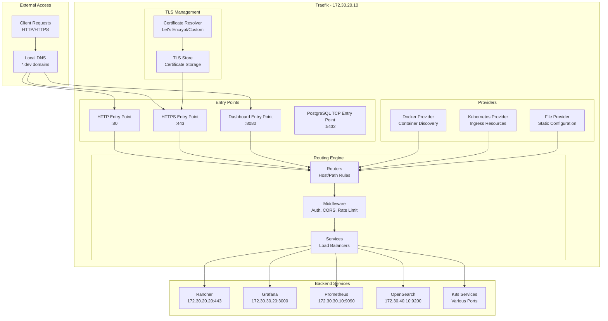

# Traefik Ingress Controller Documentation

Traefik v3.2.1 serves as the ingress controller and reverse proxy for the K3s development environment, providing advanced routing, load balancing, and SSL termination capabilities.

## 📋 Overview

Traefik acts as the main entry point for all external traffic to the Kubernetes cluster, offering:

- **Ingress Controller**: Kubernetes-native ingress management
- **Reverse Proxy**: Advanced routing and load balancing
- **SSL Termination**: Automatic certificate management
- **Load Balancing**: Multiple load balancing algorithms
- **Service Discovery**: Automatic service detection
- **Middleware Support**: Authentication, rate limiting, headers manipulation

## 🏗️ Architecture



## 🚀 Access and Configuration

### Traefik Dashboard

- **URL**: http://traefik.dev:8080
- **Authentication**: Basic Auth (configured in `.env`)
- **Features**: Real-time routing overview, service health, metrics

### Configuration Sources

Traefik configuration comes from multiple sources:

1. **Static Configuration**: `k8s-manifests/traefik.yaml`
2. **Dynamic Configuration**: Docker labels, Kubernetes resources
3. **File Configuration**: `config/traefik/` directory

## 🔧 Static Configuration

### Kubernetes Setup

```yaml
traefik:
  image: traefik:v3.2.1
  command:
    # API Configuration
    - --api.dashboard=true
    - --api.debug=true
    - --log.level=INFO
    - --accesslog=true
    - --accesslog.format=json
    
    # Providers
    - --providers.docker=true
    - --providers.docker.exposedbydefault=false
    - --providers.docker.network=dev-cluster
    - --providers.kubernetescrd=true
    - --providers.kubernetescrd.endpoint=https://k3s-server:6443
    - --providers.kubernetescrd.allowexternalnameservices=true
    
    # Entry Points
    - --entrypoints.web.address=:80
    - --entrypoints.websecure.address=:443
    - --entrypoints.traefik.address=:8080
    - --entrypoints.postgres.address=:5432
    
    # Certificate Resolvers
    - --certificatesresolvers.letsencrypt.acme.email=brewerton.santos@icloud.com
    - --certificatesresolvers.letsencrypt.acme.storage=/data/acme.json
    - --certificatesresolvers.letsencrypt.acme.httpchallenge.entrypoint=web
    
    # Metrics
    - --metrics.prometheus=true
    - --metrics.prometheus.addentrypoints=true
    - --metrics.prometheus.addrouters=true
    - --metrics.prometheus.addservices=true
```

### Environment Variables

```bash
# Traefik Configuration
TRAEFIK_AUTH=admin:$2y$10$92IXUNpkjO0rOQ5byMi.Ye4oKoEa3Ro9llC/.og/at2.uheWG/igi
TRAEFIK_K8S_TOKEN=
ACME_EMAIL=brewerton.santos@icloud.com
TRAEFIK_DASHBOARD_HOST=traefik.dev
```

## 🎯 Dynamic Configuration

### Docker Labels

Services expose themselves to Traefik using Docker labels:

```yaml
# Example: Rancher service
rancher:
  labels:
    - "traefik.enable=true"
    - "traefik.http.routers.rancher.rule=Host(`rancher.dev`)"
    - "traefik.http.routers.rancher.entrypoints=websecure"
    - "traefik.http.routers.rancher.tls=true"
    - "traefik.http.routers.rancher.tls.certresolver=letsencrypt"
    - "traefik.http.services.rancher.loadbalancer.server.port=443"
    - "traefik.http.services.rancher.loadbalancer.server.scheme=https"
```

### Kubernetes Ingress

```yaml
# Example: Kubernetes Ingress
apiVersion: networking.k8s.io/v1
kind: Ingress
metadata:
  name: app-ingress
  annotations:
    traefik.ingress.kubernetes.io/router.entrypoints: websecure
    traefik.ingress.kubernetes.io/router.tls.certresolver: letsencrypt
    traefik.ingress.kubernetes.io/router.middlewares: default-auth@kubernetescrd
spec:
  rules:
  - host: app.dev
    http:
      paths:
      - path: /
        pathType: Prefix
        backend:
          service:
            name: app-service
            port:
              number: 80
  tls:
  - hosts:
    - app.dev
    secretName: app-tls
```

### TCP Ingress (PostgreSQL)

For TCP services like databases, Traefik supports TCP routing using IngressRouteTCP:

```yaml
# Example: PostgreSQL TCP Ingress
apiVersion: traefik.io/v1alpha1
kind: IngressRouteTCP
metadata:
  name: postgres-tcp
  namespace: development
spec:
  entryPoints:
    - postgres
  routes:
  - match: HostSNI(`*`)
    services:
    - name: postgres
      port: 5432
```

#### TCP Routing Features

- **Direct TCP Proxying**: No HTTP protocol overhead
- **HostSNI Matching**: Route based on Server Name Indication
- **Load Balancing**: Multiple backend support
- **Cross-Namespace**: Services can be in different namespaces

#### Usage Example

```bash
# Connect directly to PostgreSQL via Traefik
psql -h 127.0.0.1 -p 5432 -U admin -d devdb

# No kubectl port-forward required!
```

### Traefik IngressRoute (CRD)

```yaml
# Example: Traefik native IngressRoute
apiVersion: traefik.containo.us/v1alpha1
kind: IngressRoute
metadata:
  name: app-ingressroute
  namespace: default
spec:
  entryPoints:
    - websecure
  routes:
  - match: Host(`app.dev`)
    kind: Rule
    services:
    - name: app-service
      port: 80
    middlewares:
    - name: auth-middleware
  tls:
    certResolver: letsencrypt
```

## 🔀 Routing Configuration

### Host-based Routing

```yaml
# Route based on hostname
- "traefik.http.routers.app1.rule=Host(`app1.dev`)"
- "traefik.http.routers.app2.rule=Host(`app2.dev`)"
```

### Path-based Routing

```yaml
# Route based on path
- "traefik.http.routers.api.rule=Host(`api.dev`) && PathPrefix(`/v1`)"
- "traefik.http.routers.docs.rule=Host(`api.dev`) && PathPrefix(`/docs`)"
```

### Header-based Routing

```yaml
# Route based on headers
- "traefik.http.routers.mobile.rule=Host(`app.dev`) && Headers(`User-Agent`, `.*Mobile.*`)"
```

### Priority Routing

```yaml
# Set router priority
- "traefik.http.routers.api.priority=100"
- "traefik.http.routers.fallback.priority=1"
```

## 🛡️ Middleware Configuration

### Authentication Middleware

#### Basic Auth

```yaml
# Basic authentication
- "traefik.http.middlewares.auth.basicauth.users=admin:$$2y$$10$$..."
- "traefik.http.routers.protected.middlewares=auth"
```

#### Forward Auth

```yaml
# Forward authentication to external service
apiVersion: traefik.containo.us/v1alpha1
kind: Middleware
metadata:
  name: forward-auth
spec:
  forwardAuth:
    address: http://auth-service:8080/auth
    authResponseHeaders:
      - X-User
      - X-Role
```

### Rate Limiting

```yaml
# Rate limiting middleware
apiVersion: traefik.containo.us/v1alpha1
kind: Middleware
metadata:
  name: rate-limit
spec:
  rateLimit:
    average: 100
    burst: 200
    period: 1m
```

### CORS Middleware

```yaml
# CORS configuration
apiVersion: traefik.containo.us/v1alpha1
kind: Middleware
metadata:
  name: cors
spec:
  headers:
    accessControlAllowMethods:
      - GET
      - POST
      - PUT
      - DELETE
    accessControlAllowOriginList:
      - https://app.dev
      - https://admin.dev
    accessControlAllowHeaders:
      - Content-Type
      - Authorization
```

### Redirect Middleware

```yaml
# HTTP to HTTPS redirect
- "traefik.http.middlewares.redirect-to-https.redirectscheme.scheme=https"
- "traefik.http.routers.app-insecure.middlewares=redirect-to-https"
```

## 🔒 SSL/TLS Configuration

### Let's Encrypt Integration

```yaml
# Automatic certificate generation
certificatesresolvers:
  letsencrypt:
    acme:
      email: brewerton.santos@icloud.com
      storage: /data/acme.json
      httpChallenge:
        entryPoint: web
      # Alternative: DNS challenge
      # dnsChallenge:
      #   provider: cloudflare
      #   resolvers:
      #     - "1.1.1.1:53"
```

### Custom Certificates

```yaml
# Custom certificate store
apiVersion: traefik.containo.us/v1alpha1
kind: TLSStore
metadata:
  name: default
spec:
  defaultCertificate:
    secretName: custom-cert-secret
---
apiVersion: v1
kind: Secret
metadata:
  name: custom-cert-secret
type: kubernetes.io/tls
data:
  tls.crt: LS0tLS1CRUdJTi... # base64 encoded certificate
  tls.key: LS0tLS1CRUdJTi... # base64 encoded private key
```

### TLS Options

```yaml
# TLS configuration options
apiVersion: traefik.containo.us/v1alpha1
kind: TLSOption
metadata:
  name: secure-tls
spec:
  minVersion: "VersionTLS12"
  cipherSuites:
    - "TLS_ECDHE_RSA_WITH_AES_256_GCM_SHA384"
    - "TLS_ECDHE_RSA_WITH_CHACHA20_POLY1305"
  sniStrict: true
```

## ⚖️ Load Balancing

### Load Balancing Algorithms

```yaml
# Weighted round robin
- "traefik.http.services.app.loadbalancer.server.port=8080"
- "traefik.http.services.app.loadbalancer.server.weight=1"

# Sticky sessions
- "traefik.http.services.app.loadbalancer.sticky.cookie.name=server_id"
- "traefik.http.services.app.loadbalancer.sticky.cookie.secure=true"
```

### Health Checks

```yaml
# Service health checks
apiVersion: traefik.containo.us/v1alpha1
kind: IngressRoute
metadata:
  name: app-with-healthcheck
spec:
  entryPoints:
    - websecure
  routes:
  - match: Host(`app.dev`)
    kind: Rule
    services:
    - name: app-service
      port: 8080
      healthCheck:
        path: /health
        interval: 30s
        timeout: 5s
```

### Circuit Breaker

```yaml
# Circuit breaker middleware
apiVersion: traefik.containo.us/v1alpha1
kind: Middleware
metadata:
  name: circuit-breaker
spec:
  circuitBreaker:
    expression: NetworkErrorRatio() > 0.3 || ResponseCodeRatio(500, 600, 0, 600) > 0.3
```

## 📊 Monitoring and Observability

### Prometheus Metrics

Traefik exposes metrics at `http://traefik.dev:8080/metrics`:

```yaml
# Enable Prometheus metrics
- --metrics.prometheus=true
- --metrics.prometheus.addentrypoints=true
- --metrics.prometheus.addrouters=true
- --metrics.prometheus.addservices=true
```

### Access Logs

```yaml
# Access log configuration
- --accesslog=true
- --accesslog.format=json
- --accesslog.fields.defaultmode=keep
- --accesslog.fields.headers.defaultmode=keep
```

### Tracing

```yaml
# Jaeger tracing integration
- --tracing.jaeger=true
- --tracing.jaeger.samplingparam=1.0
- --tracing.jaeger.localagenthostport=jaeger:6832
```

### Dashboard Metrics

The Traefik dashboard provides real-time insights:

- **Request Rate**: Requests per second
- **Response Times**: Latency percentiles
- **Error Rates**: 4xx/5xx response codes
- **Service Health**: Backend service status

## 🔧 Advanced Configuration

### Service Mesh Integration

```yaml
# Consul Connect integration
- --providers.consulcatalog=true
- --providers.consulcatalog.endpoints=consul:8500
- --providers.consulcatalog.connectaware=true
```

### Plugin System

```yaml
# Custom plugin configuration
apiVersion: traefik.containo.us/v1alpha1
kind: Middleware
metadata:
  name: custom-plugin
spec:
  plugin:
    customPlugin:
      option1: value1
      option2: value2
```

### Multi-Cluster Setup

```yaml
# Multiple cluster providers
- --providers.kubernetescrd.endpoint=https://cluster1:6443
- --providers.kubernetescrd.token=cluster1-token
- --providers.kubernetescrd.namespaces=default,production

# Cross-cluster services
apiVersion: traefik.containo.us/v1alpha1
kind: TraefikService
metadata:
  name: cross-cluster-service
spec:
  weighted:
    services:
    - name: cluster1-service
      weight: 70
    - name: cluster2-service
      weight: 30
```

## 🛠️ Troubleshooting

### Common Issues

#### Service Not Accessible

```bash
# Check Traefik configuration
curl -s http://traefik.dev:8080/api/rawdata | jq '.routers'

# Verify service labels
docker inspect rancher | jq '.[0].Config.Labels'

# Check Traefik logs
./k3s-helper.sh logs traefik
```

#### SSL Certificate Issues

```bash
# Check certificate status
curl -s http://traefik.dev:8080/api/rawdata | jq '.tls.certificates'

# Verify ACME challenge
./k3s-helper.sh logs traefik | grep -i acme

# Test certificate
openssl s_client -connect rancher.dev:443 -servername rancher.dev
```

#### Load Balancing Problems

```bash
# Check service health
curl -s http://traefik.dev:8080/api/rawdata | jq '.services'

# Verify backend connectivity
docker exec traefik ping rancher

# Check middleware configuration
curl -s http://traefik.dev:8080/api/rawdata | jq '.middlewares'
```

### Performance Optimization

#### Resource Limits

```yaml
# Container resource limits
traefik:
  deploy:
    resources:
      limits:
        cpu: "1"
        memory: "512Mi"
      requests:
        cpu: "500m"
        memory: "256Mi"
```

#### Connection Limits

```yaml
# Entry point configuration
- --entrypoints.web.transport.respondingTimeouts.readTimeout=60s
- --entrypoints.web.transport.respondingTimeouts.writeTimeout=60s
- --entrypoints.web.transport.respondingTimeouts.idleTimeout=180s
```

## 📚 Best Practices

### Security

1. **Enable Authentication**: Protect dashboard and sensitive services
2. **Use HTTPS**: Enforce SSL/TLS for all traffic
3. **Rate Limiting**: Implement rate limiting for public endpoints
4. **Security Headers**: Add security headers middleware
5. **Regular Updates**: Keep Traefik updated to latest stable version

### Performance

1. **Resource Allocation**: Set appropriate CPU/memory limits
2. **Connection Pooling**: Configure connection limits
3. **Caching**: Implement caching middleware for static content
4. **Compression**: Enable compression for better performance
5. **Monitoring**: Monitor metrics and optimize based on data

### Operations

1. **Health Checks**: Configure health checks for all services
2. **Circuit Breakers**: Implement circuit breakers for resilience
3. **Logging**: Enable comprehensive logging and monitoring
4. **Backup**: Regular backup of configuration and certificates
5. **Documentation**: Maintain up-to-date routing documentation

## � Session Files and Specialized Documentation

### TCP Ingress for PostgreSQL
**File**: `docs/traefik/tcp-ingress-postgresql.md`
- TCP Ingress configuration overview
- PostgreSQL database access via Traefik
- Connection examples and verification

### Quick Start Session
**File**: `docs/traefik/sessions/quick-start.md`
- Basic Traefik setup and configuration
- Creating first ingress routes
- Common troubleshooting steps

## �📖 Additional Resources

- [Traefik Documentation](https://doc.traefik.io/traefik/)
- [Kubernetes Integration](https://doc.traefik.io/traefik/providers/kubernetes-crd/)
- [Middleware Reference](https://doc.traefik.io/traefik/middlewares/overview/)
- [TLS Configuration](https://doc.traefik.io/traefik/https/tls/)
- [Monitoring Guide](https://doc.traefik.io/traefik/observability/metrics/overview/)

For specific routing examples and advanced configurations, check the `examples/traefik/` directory.
