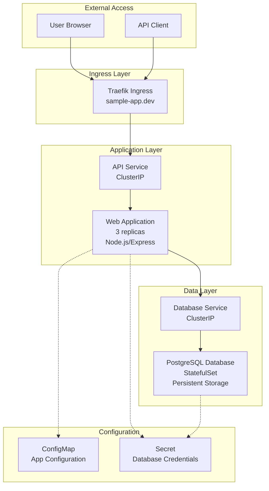

# Sample Web Application with Database

This example demonstrates how to deploy a complete web application with a database backend in the K3s development environment.

## Architecture



## Files Structure

```
examples/applications/web-app-with-db/
├── README.md
├── namespace.yaml
├── configmap.yaml
├── secret.yaml
├── database/
│   ├── pvc.yaml
│   ├── statefulset.yaml
│   └── service.yaml
├── application/
│   ├── deployment.yaml
│   ├── service.yaml
│   └── hpa.yaml
├── ingress/
│   └── ingress.yaml
└── monitoring/
    └── servicemonitor.yaml
```

## Deployment Steps

### 1. Create Namespace

```bash
kubectl apply -f namespace.yaml
```

### 2. Create Secrets and ConfigMaps

```bash
kubectl apply -f secret.yaml
kubectl apply -f configmap.yaml
```

### 3. Deploy Database

```bash
kubectl apply -f database/
```

### 4. Deploy Application

```bash
kubectl apply -f application/
```

### 5. Configure Ingress

```bash
kubectl apply -f ingress/
```

### 6. Setup Monitoring (Optional)

```bash
kubectl apply -f monitoring/
```

## Testing

### 1. Wait for Pods to be Ready

```bash
kubectl get pods -n sample-app -w
```

### 2. Test Database Connection

```bash
kubectl exec -it -n sample-app postgres-0 -- psql -U appuser -d appdb -c "SELECT version();"
```

### 3. Test Application

```bash
# Get the external IP
kubectl get svc -n sample-app

# Test the application
curl http://sample-app.dev/health
curl http://sample-app.dev/api/users
```

### 4. Monitor Resources

```bash
kubectl top pods -n sample-app
kubectl describe hpa -n sample-app
```

## Scaling

### Manual Scaling

```bash
# Scale application
kubectl scale deployment web-app -n sample-app --replicas=5

# Check status
kubectl get pods -n sample-app -l app=web-app
```

### Auto Scaling

The HPA will automatically scale based on CPU usage:

```bash
# Generate load to test auto-scaling
kubectl run -i --tty load-generator --rm --image=busybox --restart=Never -- /bin/sh
# Inside the pod:
while true; do wget -q -O- http://web-app.sample-app.svc.cluster.local; done
```

## Cleanup

```bash
kubectl delete namespace sample-app
```

## Files

### namespace.yaml
```yaml
apiVersion: v1
kind: Namespace
metadata:
  name: sample-app
  labels:
    name: sample-app
    environment: development
```

### secret.yaml
```yaml
apiVersion: v1
kind: Secret
metadata:
  name: db-credentials
  namespace: sample-app
type: Opaque
data:
  username: YXBwdXNlcg==  # appuser
  password: cGFzc3dvcmQxMjM=  # password123
  database: YXBwZGI=  # appdb
```

### configmap.yaml
```yaml
apiVersion: v1
kind: ConfigMap
metadata:
  name: app-config
  namespace: sample-app
data:
  NODE_ENV: "development"
  PORT: "3000"
  LOG_LEVEL: "info"
  DB_HOST: "postgres-service"
  DB_PORT: "5432"
  REDIS_HOST: "redis-service"
  REDIS_PORT: "6379"
  API_VERSION: "v1"
  MAX_CONNECTIONS: "100"
```

### database/pvc.yaml
```yaml
apiVersion: v1
kind: PersistentVolumeClaim
metadata:
  name: postgres-pvc
  namespace: sample-app
spec:
  accessModes:
    - ReadWriteOnce
  resources:
    requests:
      storage: 5Gi
  storageClassName: local-path
```

### database/statefulset.yaml
```yaml
apiVersion: apps/v1
kind: StatefulSet
metadata:
  name: postgres
  namespace: sample-app
spec:
  serviceName: postgres-service
  replicas: 1
  selector:
    matchLabels:
      app: postgres
  template:
    metadata:
      labels:
        app: postgres
    spec:
      containers:
      - name: postgres
        image: postgres:13-alpine
        ports:
        - containerPort: 5432
        env:
        - name: POSTGRES_USER
          valueFrom:
            secretKeyRef:
              name: db-credentials
              key: username
        - name: POSTGRES_PASSWORD
          valueFrom:
            secretKeyRef:
              name: db-credentials
              key: password
        - name: POSTGRES_DB
          valueFrom:
            secretKeyRef:
              name: db-credentials
              key: database
        - name: PGDATA
          value: /var/lib/postgresql/data/pgdata
        volumeMounts:
        - name: postgres-storage
          mountPath: /var/lib/postgresql/data
        resources:
          requests:
            memory: "256Mi"
            cpu: "100m"
          limits:
            memory: "512Mi"
            cpu: "500m"
        livenessProbe:
          exec:
            command:
            - pg_isready
            - -U
            - $(POSTGRES_USER)
            - -d
            - $(POSTGRES_DB)
          initialDelaySeconds: 30
          periodSeconds: 10
        readinessProbe:
          exec:
            command:
            - pg_isready
            - -U
            - $(POSTGRES_USER)
            - -d
            - $(POSTGRES_DB)
          initialDelaySeconds: 5
          periodSeconds: 5
  volumeClaimTemplates:
  - metadata:
      name: postgres-storage
    spec:
      accessModes: ["ReadWriteOnce"]
      resources:
        requests:
          storage: 5Gi
      storageClassName: local-path
```

### database/service.yaml
```yaml
apiVersion: v1
kind: Service
metadata:
  name: postgres-service
  namespace: sample-app
spec:
  selector:
    app: postgres
  ports:
  - port: 5432
    targetPort: 5432
  type: ClusterIP
```

### application/deployment.yaml
```yaml
apiVersion: apps/v1
kind: Deployment
metadata:
  name: web-app
  namespace: sample-app
  labels:
    app: web-app
spec:
  replicas: 3
  selector:
    matchLabels:
      app: web-app
  template:
    metadata:
      labels:
        app: web-app
      annotations:
        prometheus.io/scrape: "true"
        prometheus.io/port: "3000"
        prometheus.io/path: "/metrics"
    spec:
      containers:
      - name: web-app
        image: node:16-alpine
        ports:
        - containerPort: 3000
        env:
        - name: NODE_ENV
          valueFrom:
            configMapKeyRef:
              name: app-config
              key: NODE_ENV
        - name: PORT
          valueFrom:
            configMapKeyRef:
              name: app-config
              key: PORT
        - name: DB_HOST
          valueFrom:
            configMapKeyRef:
              name: app-config
              key: DB_HOST
        - name: DB_PORT
          valueFrom:
            configMapKeyRef:
              name: app-config
              key: DB_PORT
        - name: DB_USER
          valueFrom:
            secretKeyRef:
              name: db-credentials
              key: username
        - name: DB_PASSWORD
          valueFrom:
            secretKeyRef:
              name: db-credentials
              key: password
        - name: DB_NAME
          valueFrom:
            secretKeyRef:
              name: db-credentials
              key: database
        command: ["/bin/sh"]
        args:
        - -c
        - |
          npm init -y
          npm install express pg prometheus-client
          cat > app.js << 'EOF'
          const express = require('express');
          const { Pool } = require('pg');
          const client = require('prom-client');
          
          const app = express();
          const port = process.env.PORT || 3000;
          
          // Prometheus metrics
          const register = new client.Registry();
          client.collectDefaultMetrics({ register });
          
          const httpRequestsTotal = new client.Counter({
            name: 'http_requests_total',
            help: 'Total number of HTTP requests',
            labelNames: ['method', 'route', 'status_code'],
            registers: [register]
          });
          
          // Database connection
          const pool = new Pool({
            user: process.env.DB_USER,
            host: process.env.DB_HOST,
            database: process.env.DB_NAME,
            password: process.env.DB_PASSWORD,
            port: process.env.DB_PORT,
          });
          
          app.use(express.json());
          
          // Middleware to track requests
          app.use((req, res, next) => {
            res.on('finish', () => {
              httpRequestsTotal.inc({
                method: req.method,
                route: req.route?.path || req.path,
                status_code: res.statusCode
              });
            });
            next();
          });
          
          // Health check endpoint
          app.get('/health', async (req, res) => {
            try {
              await pool.query('SELECT 1');
              res.json({ status: 'healthy', timestamp: new Date().toISOString() });
            } catch (err) {
              res.status(500).json({ status: 'unhealthy', error: err.message });
            }
          });
          
          // Metrics endpoint
          app.get('/metrics', async (req, res) => {
            res.set('Content-Type', register.contentType);
            res.end(await register.metrics());
          });
          
          // API endpoints
          app.get('/api/users', async (req, res) => {
            try {
              const result = await pool.query('SELECT * FROM users');
              res.json(result.rows);
            } catch (err) {
              res.status(500).json({ error: err.message });
            }
          });
          
          app.post('/api/users', async (req, res) => {
            try {
              const { name, email } = req.body;
              const result = await pool.query(
                'INSERT INTO users (name, email) VALUES ($1, $2) RETURNING *',
                [name, email]
              );
              res.status(201).json(result.rows[0]);
            } catch (err) {
              res.status(400).json({ error: err.message });
            }
          });
          
          // Initialize database
          async function initDB() {
            try {
              await pool.query(`
                CREATE TABLE IF NOT EXISTS users (
                  id SERIAL PRIMARY KEY,
                  name VARCHAR(100) NOT NULL,
                  email VARCHAR(100) UNIQUE NOT NULL,
                  created_at TIMESTAMP DEFAULT CURRENT_TIMESTAMP
                )
              `);
              console.log('Database initialized');
            } catch (err) {
              console.error('Database initialization error:', err);
            }
          }
          
          app.listen(port, '0.0.0.0', () => {
            console.log(`Server running on port ${port}`);
            initDB();
          });
          EOF
          node app.js
        resources:
          requests:
            memory: "128Mi"
            cpu: "100m"
          limits:
            memory: "256Mi"
            cpu: "500m"
        livenessProbe:
          httpGet:
            path: /health
            port: 3000
          initialDelaySeconds: 30
          periodSeconds: 10
        readinessProbe:
          httpGet:
            path: /health
            port: 3000
          initialDelaySeconds: 5
          periodSeconds: 5
```

### application/service.yaml
```yaml
apiVersion: v1
kind: Service
metadata:
  name: web-app-service
  namespace: sample-app
  labels:
    app: web-app
spec:
  selector:
    app: web-app
  ports:
  - name: http
    port: 80
    targetPort: 3000
  type: ClusterIP
```

### application/hpa.yaml
```yaml
apiVersion: autoscaling/v2
kind: HorizontalPodAutoscaler
metadata:
  name: web-app-hpa
  namespace: sample-app
spec:
  scaleTargetRef:
    apiVersion: apps/v1
    kind: Deployment
    name: web-app
  minReplicas: 2
  maxReplicas: 10
  metrics:
  - type: Resource
    resource:
      name: cpu
      target:
        type: Utilization
        averageUtilization: 70
  - type: Resource
    resource:
      name: memory
      target:
        type: Utilization
        averageUtilization: 80
  behavior:
    scaleDown:
      stabilizationWindowSeconds: 300
      policies:
      - type: Percent
        value: 50
        periodSeconds: 60
    scaleUp:
      stabilizationWindowSeconds: 60
      policies:
      - type: Percent
        value: 100
        periodSeconds: 60
```

### ingress/ingress.yaml
```yaml
apiVersion: networking.k8s.io/v1
kind: Ingress
metadata:
  name: web-app-ingress
  namespace: sample-app
  annotations:
    traefik.ingress.kubernetes.io/router.entrypoints: web,websecure
    traefik.ingress.kubernetes.io/router.tls.certresolver: letsencrypt
    traefik.ingress.kubernetes.io/router.middlewares: sample-app-rate-limit@kubernetescrd
spec:
  rules:
  - host: sample-app.dev
    http:
      paths:
      - path: /
        pathType: Prefix
        backend:
          service:
            name: web-app-service
            port:
              number: 80
  tls:
  - hosts:
    - sample-app.dev
    secretName: sample-app-tls
---
apiVersion: traefik.containo.us/v1alpha1
kind: Middleware
metadata:
  name: rate-limit
  namespace: sample-app
spec:
  rateLimit:
    burst: 100
    average: 50
    period: 1m
```

### monitoring/servicemonitor.yaml
```yaml
apiVersion: monitoring.coreos.com/v1
kind: ServiceMonitor
metadata:
  name: web-app-monitor
  namespace: sample-app
  labels:
    app: web-app
spec:
  selector:
    matchLabels:
      app: web-app
  endpoints:
  - port: http
    path: /metrics
    interval: 30s
    scrapeTimeout: 10s
```
