# ArgoCD GitOps Application Example

This example demonstrates a complete GitOps setup for a web application with database using ArgoCD, including multiple environments and CI/CD integration.

## Application Architecture

```mermaid
graph TB
    subgraph "GitOps Repository"
        GIT[Git Repository<br/>Source of Truth]
        ENV_DEV[environments/dev/]
        ENV_STAGING[environments/staging/]
        ENV_PROD[environments/production/]
        APPS[applications/]
        BASE[base/]
    end
    
    subgraph "CI/CD Pipeline"
        CI[GitHub Actions]
        BUILD[Build & Test]
        IMAGE[Container Registry]
    end
    
    subgraph "ArgoCD"
        ARGOCD_SERVER[ArgoCD Server]
        APP_DEV[Dev Application]
        APP_STAGING[Staging Application]
        APP_PROD[Production Application]
    end
    
    subgraph "K3s Cluster"
        NS_DEV[development namespace]
        NS_STAGING[staging namespace]
        NS_PROD[production namespace]
        
        subgraph "Dev Environment"
            WEB_DEV[Web App Pod]
            DB_DEV[PostgreSQL]
            REDIS_DEV[Redis Cache]
        end
        
        subgraph "Staging Environment"
            WEB_STAGING[Web App Pod]
            DB_STAGING[PostgreSQL]
            REDIS_STAGING[Redis Cache]
        end
        
        subgraph "Production Environment"
            WEB_PROD[Web App Pods]
            DB_PROD[PostgreSQL HA]
            REDIS_PROD[Redis Cluster]
        end
    end
    
    %% Workflow
    CI -->|Build & Push| IMAGE
    CI -->|Update Manifests| GIT
    GIT --> ARGOCD_SERVER
    ARGOCD_SERVER --> APP_DEV
    ARGOCD_SERVER --> APP_STAGING
    ARGOCD_SERVER --> APP_PROD
    
    APP_DEV -->|Deploy| NS_DEV
    APP_STAGING -->|Deploy| NS_STAGING
    APP_PROD -->|Deploy| NS_PROD
    
    NS_DEV --> WEB_DEV
    NS_DEV --> DB_DEV
    NS_DEV --> REDIS_DEV
    
    NS_STAGING --> WEB_STAGING
    NS_STAGING --> DB_STAGING
    NS_STAGING --> REDIS_STAGING
    
    NS_PROD --> WEB_PROD
    NS_PROD --> DB_PROD
    NS_PROD --> REDIS_PROD
    
    %% Styling
    classDef git fill:#f9f9f9,stroke:#333,stroke-width:2px
    classDef ci fill:#326ce5,stroke:#fff,stroke-width:2px,color:#fff
    classDef argocd fill:#ef7b4d,stroke:#fff,stroke-width:2px,color:#fff
    classDef k8s fill:#ff6b35,stroke:#fff,stroke-width:2px,color:#fff
    
    class GIT,ENV_DEV,ENV_STAGING,ENV_PROD,APPS,BASE git
    class CI,BUILD,IMAGE ci
    class ARGOCD_SERVER,APP_DEV,APP_STAGING,APP_PROD argocd
    class NS_DEV,NS_STAGING,NS_PROD,WEB_DEV,WEB_STAGING,WEB_PROD,DB_DEV,DB_STAGING,DB_PROD,REDIS_DEV,REDIS_STAGING,REDIS_PROD k8s
```



## Repository Structure

```
gitops-web-app/
├── README.md
├── .github/
│   └── workflows/
│       └── ci-cd.yml
├── applications/
│   ├── development/
│   │   └── web-app-dev.yaml
│   ├── staging/
│   │   └── web-app-staging.yaml
│   └── production/
│       └── web-app-prod.yaml
├── projects/
│   └── web-app-projects.yaml
├── base/
│   ├── kustomization.yaml
│   ├── deployment.yaml
│   ├── service.yaml
│   ├── configmap.yaml
│   ├── postgresql.yaml
│   └── redis.yaml
└── environments/
    ├── development/
    │   ├── kustomization.yaml
    │   ├── namespace.yaml
    │   ├── patches/
    │   │   ├── deployment-patch.yaml
    │   │   ├── resources-patch.yaml
    │   │   └── config-patch.yaml
    │   └── sealed-secrets/
    │       └── database-secret.yaml
    ├── staging/
    │   ├── kustomization.yaml
    │   ├── namespace.yaml
    │   ├── patches/
    │   │   ├── deployment-patch.yaml
    │   │   ├── resources-patch.yaml
    │   │   └── config-patch.yaml
    │   └── sealed-secrets/
    │       └── database-secret.yaml
    └── production/
        ├── kustomization.yaml
        ├── namespace.yaml
        ├── patches/
        │   ├── deployment-patch.yaml
        │   ├── resources-patch.yaml
        │   ├── hpa-patch.yaml
        │   └── config-patch.yaml
        └── sealed-secrets/
            └── database-secret.yaml
```

## Base Kubernetes Manifests

### Application Deployment

```yaml
# base/deployment.yaml
apiVersion: apps/v1
kind: Deployment
metadata:
  name: web-app
  labels:
    app.kubernetes.io/name: web-app
    app.kubernetes.io/component: frontend
spec:
  replicas: 1
  selector:
    matchLabels:
      app.kubernetes.io/name: web-app
  template:
    metadata:
      labels:
        app.kubernetes.io/name: web-app
    spec:
      containers:
      - name: web-app
        image: ghcr.io/company/web-app:latest
        ports:
        - containerPort: 8080
          name: http
        env:
        - name: DATABASE_URL
          valueFrom:
            secretKeyRef:
              name: database-secret
              key: url
        - name: REDIS_URL
          valueFrom:
            configMapKeyRef:
              name: app-config
              key: redis-url
        - name: NODE_ENV
          valueFrom:
            configMapKeyRef:
              name: app-config
              key: environment
        resources:
          requests:
            memory: "128Mi"
            cpu: "100m"
          limits:
            memory: "256Mi"
            cpu: "200m"
        livenessProbe:
          httpGet:
            path: /health
            port: http
          initialDelaySeconds: 30
          periodSeconds: 10
        readinessProbe:
          httpGet:
            path: /ready
            port: http
          initialDelaySeconds: 5
          periodSeconds: 5
        securityContext:
          allowPrivilegeEscalation: false
          runAsNonRoot: true
          runAsUser: 1001
          capabilities:
            drop:
            - ALL
```

### Service Configuration

```yaml
# base/service.yaml
apiVersion: v1
kind: Service
metadata:
  name: web-app-service
  labels:
    app.kubernetes.io/name: web-app
    app.kubernetes.io/component: frontend
spec:
  selector:
    app.kubernetes.io/name: web-app
  ports:
  - port: 80
    targetPort: http
    protocol: TCP
    name: http
  type: ClusterIP
```

### PostgreSQL Database

```yaml
# base/postgresql.yaml
apiVersion: apps/v1
kind: StatefulSet
metadata:
  name: postgresql
  labels:
    app.kubernetes.io/name: postgresql
    app.kubernetes.io/component: database
spec:
  serviceName: postgresql
  replicas: 1
  selector:
    matchLabels:
      app.kubernetes.io/name: postgresql
  template:
    metadata:
      labels:
        app.kubernetes.io/name: postgresql
    spec:
      containers:
      - name: postgresql
        image: postgres:15.4
        env:
        - name: POSTGRES_DB
          value: webapp
        - name: POSTGRES_USER
          valueFrom:
            secretKeyRef:
              name: database-secret
              key: username
        - name: POSTGRES_PASSWORD
          valueFrom:
            secretKeyRef:
              name: database-secret
              key: password
        ports:
        - containerPort: 5432
          name: postgres
        volumeMounts:
        - name: postgresql-data
          mountPath: /var/lib/postgresql/data
        resources:
          requests:
            memory: "256Mi"
            cpu: "100m"
          limits:
            memory: "512Mi"
            cpu: "200m"
  volumeClaimTemplates:
  - metadata:
      name: postgresql-data
    spec:
      accessModes: ["ReadWriteOnce"]
      resources:
        requests:
          storage: 10Gi
---
apiVersion: v1
kind: Service
metadata:
  name: postgresql
  labels:
    app.kubernetes.io/name: postgresql
    app.kubernetes.io/component: database
spec:
  selector:
    app.kubernetes.io/name: postgresql
  ports:
  - port: 5432
    targetPort: postgres
    protocol: TCP
    name: postgres
  type: ClusterIP
```

### Redis Cache

```yaml
# base/redis.yaml
apiVersion: apps/v1
kind: Deployment
metadata:
  name: redis
  labels:
    app.kubernetes.io/name: redis
    app.kubernetes.io/component: cache
spec:
  replicas: 1
  selector:
    matchLabels:
      app.kubernetes.io/name: redis
  template:
    metadata:
      labels:
        app.kubernetes.io/name: redis
    spec:
      containers:
      - name: redis
        image: redis:7.2.4-alpine
        ports:
        - containerPort: 6379
          name: redis
        command:
        - redis-server
        - --maxmemory
        - 256mb
        - --maxmemory-policy
        - allkeys-lru
        resources:
          requests:
            memory: "64Mi"
            cpu: "50m"
          limits:
            memory: "128Mi"
            cpu: "100m"
        livenessProbe:
          exec:
            command:
            - redis-cli
            - ping
          initialDelaySeconds: 30
          periodSeconds: 10
        readinessProbe:
          exec:
            command:
            - redis-cli
            - ping
          initialDelaySeconds: 5
          periodSeconds: 5
---
apiVersion: v1
kind: Service
metadata:
  name: redis
  labels:
    app.kubernetes.io/name: redis
    app.kubernetes.io/component: cache
spec:
  selector:
    app.kubernetes.io/name: redis
  ports:
  - port: 6379
    targetPort: redis
    protocol: TCP
    name: redis
  type: ClusterIP
```

### Base Kustomization

```yaml
# base/kustomization.yaml
apiVersion: kustomize.config.k8s.io/v1beta1
kind: Kustomization

metadata:
  name: web-app-base

resources:
- deployment.yaml
- service.yaml
- postgresql.yaml
- redis.yaml
- configmap.yaml

commonLabels:
  app.kubernetes.io/part-of: web-app-system
  app.kubernetes.io/managed-by: argocd

images:
- name: ghcr.io/company/web-app
  newTag: latest
```

## Environment-Specific Configurations

### Development Environment

```yaml
# environments/development/kustomization.yaml
apiVersion: kustomize.config.k8s.io/v1beta1
kind: Kustomization

metadata:
  name: web-app-development

namespace: development

resources:
- ../../base
- namespace.yaml
- sealed-secrets/

namePrefix: dev-
nameSuffix: -dev

commonLabels:
  environment: development

images:
- name: ghcr.io/company/web-app
  newTag: main-latest

patches:
- path: patches/deployment-patch.yaml
- path: patches/resources-patch.yaml
- path: patches/config-patch.yaml

configMapGenerator:
- name: app-config
  literals:
  - environment=development
  - debug=true
  - log-level=debug
  - redis-url=redis://redis:6379/0
```

```yaml
# environments/development/namespace.yaml
apiVersion: v1
kind: Namespace
metadata:
  name: development
  labels:
    name: development
    environment: development
    managed-by: argocd
```

```yaml
# environments/development/patches/deployment-patch.yaml
apiVersion: apps/v1
kind: Deployment
metadata:
  name: web-app
spec:
  replicas: 1
  template:
    spec:
      containers:
      - name: web-app
        env:
        - name: DEBUG
          value: "true"
        - name: LOG_LEVEL
          value: "debug"
        resources:
          requests:
            memory: "64Mi"
            cpu: "50m"
          limits:
            memory: "128Mi"
            cpu: "100m"
```

### Staging Environment

```yaml
# environments/staging/kustomization.yaml
apiVersion: kustomize.config.k8s.io/v1beta1
kind: Kustomization

metadata:
  name: web-app-staging

namespace: staging

resources:
- ../../base
- namespace.yaml
- sealed-secrets/

namePrefix: staging-
nameSuffix: -staging

commonLabels:
  environment: staging

images:
- name: ghcr.io/company/web-app
  newTag: v1.2.3

patches:
- path: patches/deployment-patch.yaml
- path: patches/resources-patch.yaml
- path: patches/config-patch.yaml

configMapGenerator:
- name: app-config
  literals:
  - environment=staging
  - debug=false
  - log-level=info
  - redis-url=redis://redis:6379/1
```

### Production Environment

```yaml
# environments/production/kustomization.yaml
apiVersion: kustomize.config.k8s.io/v1beta1
kind: Kustomization

metadata:
  name: web-app-production

namespace: production

resources:
- ../../base
- namespace.yaml
- sealed-secrets/

namePrefix: prod-
nameSuffix: -prod

commonLabels:
  environment: production

images:
- name: ghcr.io/company/web-app
  newTag: v1.2.2

patches:
- path: patches/deployment-patch.yaml
- path: patches/resources-patch.yaml
- path: patches/hpa-patch.yaml
- path: patches/config-patch.yaml

configMapGenerator:
- name: app-config
  literals:
  - environment=production
  - debug=false
  - log-level=warn
  - redis-url=redis://redis:6379/2
```

```yaml
# environments/production/patches/hpa-patch.yaml
apiVersion: autoscaling/v2
kind: HorizontalPodAutoscaler
metadata:
  name: web-app-hpa
spec:
  scaleTargetRef:
    apiVersion: apps/v1
    kind: Deployment
    name: prod-web-app-prod
  minReplicas: 3
  maxReplicas: 10
  metrics:
  - type: Resource
    resource:
      name: cpu
      target:
        type: Utilization
        averageUtilization: 70
  - type: Resource
    resource:
      name: memory
      target:
        type: Utilization
        averageUtilization: 80
```

## ArgoCD Applications

### Development Application

```yaml
# applications/development/web-app-dev.yaml
apiVersion: argoproj.io/v1alpha1
kind: Application
metadata:
  name: web-app-dev
  namespace: argocd
  labels:
    environment: development
    team: platform
  annotations:
    notifications.argoproj.io/subscribe.on-sync-succeeded.slack: dev-notifications
    notifications.argoproj.io/subscribe.on-sync-failed.slack: dev-alerts
spec:
  project: development
  source:
    repoURL: https://github.com/company/gitops-web-app
    targetRevision: main
    path: environments/development
  destination:
    server: https://kubernetes.default.svc
    namespace: development
  syncPolicy:
    automated:
      prune: true
      selfHeal: true
    syncOptions:
    - CreateNamespace=true
    - PrunePropagationPolicy=foreground
    - PruneLast=true
    retry:
      limit: 5
      backoff:
        duration: 5s
        factor: 2
        maxDuration: 3m
  revisionHistoryLimit: 10
```

### Staging Application

```yaml
# applications/staging/web-app-staging.yaml
apiVersion: argoproj.io/v1alpha1
kind: Application
metadata:
  name: web-app-staging
  namespace: argocd
  labels:
    environment: staging
    team: platform
  annotations:
    notifications.argoproj.io/subscribe.on-sync-succeeded.slack: staging-notifications
    notifications.argoproj.io/subscribe.on-sync-failed.slack: staging-alerts
spec:
  project: staging
  source:
    repoURL: https://github.com/company/gitops-web-app
    targetRevision: staging
    path: environments/staging
  destination:
    server: https://kubernetes.default.svc
    namespace: staging
  syncPolicy:
    automated:
      prune: true
      selfHeal: false  # Manual healing for staging
    syncOptions:
    - CreateNamespace=true
    - PrunePropagationPolicy=foreground
    retry:
      limit: 3
      backoff:
        duration: 10s
        factor: 2
        maxDuration: 5m
  revisionHistoryLimit: 5
```

### Production Application

```yaml
# applications/production/web-app-prod.yaml
apiVersion: argoproj.io/v1alpha1
kind: Application
metadata:
  name: web-app-prod
  namespace: argocd
  labels:
    environment: production
    team: platform
  annotations:
    notifications.argoproj.io/subscribe.on-sync-succeeded.slack: prod-notifications
    notifications.argoproj.io/subscribe.on-sync-failed.slack: prod-alerts
    notifications.argoproj.io/subscribe.on-health-degraded.slack: prod-critical
spec:
  project: production
  source:
    repoURL: https://github.com/company/gitops-web-app
    targetRevision: production
    path: environments/production
  destination:
    server: https://kubernetes.default.svc
    namespace: production
  syncPolicy:
    # Manual sync for production
    syncOptions:
    - CreateNamespace=true
    - PrunePropagationPolicy=foreground
    retry:
      limit: 2
      backoff:
        duration: 30s
        factor: 2
        maxDuration: 10m
  revisionHistoryLimit: 10
```

## CI/CD Pipeline Integration

```yaml
# .github/workflows/ci-cd.yml
name: Web App CI/CD Pipeline

on:
  push:
    branches: [main, staging, production]
  pull_request:
    branches: [main]

env:
  REGISTRY: ghcr.io
  IMAGE_NAME: company/web-app

jobs:
  test:
    runs-on: ubuntu-latest
    steps:
    - name: Checkout code
      uses: actions/checkout@v3

    - name: Set up Node.js
      uses: actions/setup-node@v3
      with:
        node-version: '18'
        cache: 'npm'

    - name: Install dependencies
      run: npm ci

    - name: Run linting
      run: npm run lint

    - name: Run tests
      run: npm test

    - name: Run security audit
      run: npm audit --audit-level moderate

  build:
    needs: test
    runs-on: ubuntu-latest
    outputs:
      image-tag: ${{ steps.meta.outputs.tags }}
      image-digest: ${{ steps.build.outputs.digest }}
    steps:
    - name: Checkout code
      uses: actions/checkout@v3

    - name: Set up Docker Buildx
      uses: docker/setup-buildx-action@v2

    - name: Log in to Container Registry
      uses: docker/login-action@v2
      with:
        registry: ${{ env.REGISTRY }}
        username: ${{ github.actor }}
        password: ${{ secrets.GITHUB_TOKEN }}

    - name: Extract metadata
      id: meta
      uses: docker/metadata-action@v4
      with:
        images: ${{ env.REGISTRY }}/${{ env.IMAGE_NAME }}
        tags: |
          type=ref,event=branch
          type=ref,event=pr
          type=sha,prefix={{branch}}-

    - name: Build and push Docker image
      id: build
      uses: docker/build-push-action@v4
      with:
        context: .
        push: true
        tags: ${{ steps.meta.outputs.tags }}
        labels: ${{ steps.meta.outputs.labels }}
        cache-from: type=gha
        cache-to: type=gha,mode=max

  update-dev:
    needs: build
    runs-on: ubuntu-latest
    if: github.ref == 'refs/heads/main'
    steps:
    - name: Checkout GitOps repository
      uses: actions/checkout@v3
      with:
        repository: company/gitops-web-app
        token: ${{ secrets.GITOPS_TOKEN }}
        path: gitops

    - name: Update development environment
      run: |
        cd gitops
        # Update image tag in development
        sed -i "s|newTag: .*|newTag: main-${{ github.sha }}|" environments/development/kustomization.yaml
        
        # Commit and push changes
        git config user.name "GitOps Bot"
        git config user.email "gitops-bot@company.com"
        git add environments/development/kustomization.yaml
        git commit -m "Update dev image to main-${{ github.sha }}"
        git push

  promote-to-staging:
    needs: [build, update-dev]
    runs-on: ubuntu-latest
    if: github.ref == 'refs/heads/main'
    environment: staging-approval
    steps:
    - name: Checkout GitOps repository
      uses: actions/checkout@v3
      with:
        repository: company/gitops-web-app
        token: ${{ secrets.GITOPS_TOKEN }}
        path: gitops
        ref: staging

    - name: Update staging environment
      run: |
        cd gitops
        # Create version tag
        VERSION="v$(date +%Y%m%d)-$(echo ${{ github.sha }} | cut -c1-8)"
        
        # Update image tag in staging
        sed -i "s|newTag: .*|newTag: ${VERSION}|" environments/staging/kustomization.yaml
        
        # Commit and push changes
        git config user.name "GitOps Bot"
        git config user.email "gitops-bot@company.com"
        git add environments/staging/kustomization.yaml
        git commit -m "Promote ${VERSION} to staging"
        git push

  promote-to-production:
    needs: promote-to-staging
    runs-on: ubuntu-latest
    if: github.ref == 'refs/heads/production'
    environment: production-approval
    steps:
    - name: Checkout GitOps repository
      uses: actions/checkout@v3
      with:
        repository: company/gitops-web-app
        token: ${{ secrets.GITOPS_TOKEN }}
        path: gitops
        ref: production

    - name: Update production environment
      run: |
        cd gitops
        # Get version from staging
        STAGING_VERSION=$(grep "newTag:" environments/staging/kustomization.yaml | awk '{print $2}')
        
        # Update image tag in production
        sed -i "s|newTag: .*|newTag: ${STAGING_VERSION}|" environments/production/kustomization.yaml
        
        # Commit and push changes
        git config user.name "GitOps Bot"
        git config user.email "gitops-bot@company.com"
        git add environments/production/kustomization.yaml
        git commit -m "Promote ${STAGING_VERSION} to production"
        git push
```

## Deployment Instructions

### 1. Setup ArgoCD Applications

```bash
# Apply ArgoCD projects
kubectl apply -f projects/web-app-projects.yaml

# Apply development application
kubectl apply -f applications/development/web-app-dev.yaml

# Apply staging application
kubectl apply -f applications/staging/web-app-staging.yaml

# Apply production application (manual sync)
kubectl apply -f applications/production/web-app-prod.yaml
```

### 2. Initial Sync

```bash
# Sync development environment
argocd app sync web-app-dev

# Sync staging environment
argocd app sync web-app-staging

# Production requires manual approval
argocd app sync web-app-prod --dry-run
```

### 3. Monitor Applications

```bash
# Check application status
argocd app list

# Get application details
argocd app get web-app-dev

# View application logs
argocd app logs web-app-dev --tail
```

### 4. Test Application

```bash
# Check pods
kubectl get pods -n development
kubectl get pods -n staging
kubectl get pods -n production

# Test application endpoints
kubectl port-forward -n development svc/dev-web-app-service-dev 8080:80
curl http://localhost:8080/health

# Check application logs
kubectl logs -n development deployment/dev-web-app-dev
```

## Benefits of This GitOps Setup

### 1. **Declarative Configuration**
- All application state defined in Git
- Version controlled infrastructure
- Reproducible deployments

### 2. **Environment Isolation**
- Separate configurations per environment
- Different sync policies per environment
- Progressive deployment strategy

### 3. **Automated Operations**
- Automatic deployment to development
- Approval gates for staging/production
- Self-healing capabilities

### 4. **Observability**
- Complete audit trail in Git
- Real-time application monitoring
- Automated notifications

### 5. **Security**
- No cluster access required for developers
- Sealed secrets for sensitive data
- RBAC-based access control

This example provides a complete, production-ready GitOps setup that you can adapt for your own applications.
