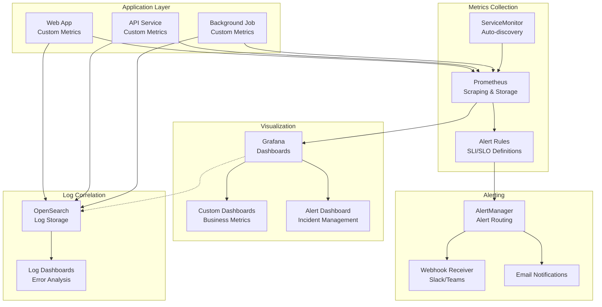

# Custom Monitoring Setup

This example demonstrates how to set up comprehensive monitoring for applications in the K3s development environment using Prometheus, Grafana, and custom metrics.

## Overview

This monitoring setup includes:
- Application metrics collection with Prometheus
- Custom Grafana dashboards
- Alerting rules for common issues
- Log correlation with OpenSearch
- Performance monitoring and SLI/SLO tracking

## Architecture



## Files Structure

```
examples/monitoring/
├── README.md
├── prometheus/
│   ├── prometheus-rules.yaml
│   ├── servicemonitor.yaml
│   └── recording-rules.yaml
├── grafana/
│   ├── dashboards/
│   │   ├── application-overview.json
│   │   ├── business-metrics.json
│   │   ├── infrastructure.json
│   │   └── sli-slo.json
│   └── datasources.yaml
├── alerting/
│   ├── alertmanager-config.yaml
│   ├── alert-rules.yaml
│   └── notification-templates.yaml
└── sample-app/
    ├── deployment.yaml
    └── metrics-exporter.yaml
```

## Setup Instructions

### 1. Deploy Sample Application with Metrics

```bash
kubectl apply -f sample-app/
```

### 2. Configure Prometheus Rules

```bash
kubectl apply -f prometheus/
```

### 3. Import Grafana Dashboards

```bash
# Upload dashboards through Grafana UI or API
curl -X POST \
  -H "Content-Type: application/json" \
  -H "Authorization: Bearer YOUR_API_KEY" \
  -d @grafana/dashboards/application-overview.json \
  http://grafana.dev:3000/api/dashboards/db
```

### 4. Setup Alerting

```bash
kubectl apply -f alerting/
```

## Monitoring Examples

### Custom Application Metrics

#### HTTP Request Metrics
```javascript
// Node.js/Express example
const client = require('prom-client');

// Create a Registry
const register = new client.Registry();

// Define metrics
const httpRequestsTotal = new client.Counter({
  name: 'http_requests_total',
  help: 'Total number of HTTP requests',
  labelNames: ['method', 'route', 'status_code'],
  registers: [register]
});

const httpRequestDuration = new client.Histogram({
  name: 'http_request_duration_seconds',
  help: 'Duration of HTTP requests in seconds',
  labelNames: ['method', 'route'],
  buckets: [0.1, 0.5, 1, 2, 5],
  registers: [register]
});

const activeConnections = new client.Gauge({
  name: 'active_connections',
  help: 'Number of active connections',
  registers: [register]
});

// Middleware to track metrics
app.use((req, res, next) => {
  const start = Date.now();
  
  res.on('finish', () => {
    const duration = (Date.now() - start) / 1000;
    
    httpRequestsTotal.inc({
      method: req.method,
      route: req.route?.path || req.path,
      status_code: res.statusCode
    });
    
    httpRequestDuration.observe({
      method: req.method,
      route: req.route?.path || req.path
    }, duration);
  });
  
  next();
});

// Metrics endpoint
app.get('/metrics', async (req, res) => {
  res.set('Content-Type', register.contentType);
  res.end(await register.metrics());
});
```

#### Business Metrics
```javascript
// Business-specific metrics
const ordersTotal = new client.Counter({
  name: 'orders_total',
  help: 'Total number of orders',
  labelNames: ['status', 'payment_method'],
  registers: [register]
});

const revenueTotal = new client.Counter({
  name: 'revenue_total',
  help: 'Total revenue',
  labelNames: ['currency'],
  registers: [register]
});

const userSessions = new client.Gauge({
  name: 'active_user_sessions',
  help: 'Number of active user sessions',
  registers: [register]
});

// Usage in business logic
app.post('/api/orders', async (req, res) => {
  try {
    const order = await createOrder(req.body);
    
    ordersTotal.inc({
      status: 'created',
      payment_method: order.paymentMethod
    });
    
    revenueTotal.inc({
      currency: order.currency
    }, order.amount);
    
    res.json(order);
  } catch (error) {
    ordersTotal.inc({
      status: 'failed',
      payment_method: 'unknown'
    });
    
    res.status(500).json({ error: error.message });
  }
});
```

### Prometheus Recording Rules

**File**: `prometheus/recording-rules.yaml`

```yaml
apiVersion: monitoring.coreos.com/v1
kind: PrometheusRule
metadata:
  name: recording-rules
  namespace: monitoring
spec:
  groups:
  - name: application.rules
    interval: 30s
    rules:
    # Request rate
    - record: app:http_requests:rate5m
      expr: |
        sum(rate(http_requests_total[5m])) by (instance, job, method)
        
    # Error rate
    - record: app:http_requests:error_rate5m
      expr: |
        sum(rate(http_requests_total{status_code=~"5.."}[5m])) by (instance, job) /
        sum(rate(http_requests_total[5m])) by (instance, job)
        
    # Request duration percentiles
    - record: app:http_request_duration:p95
      expr: |
        histogram_quantile(0.95, sum(rate(http_request_duration_seconds_bucket[5m])) by (instance, job, le))
        
    - record: app:http_request_duration:p99
      expr: |
        histogram_quantile(0.99, sum(rate(http_request_duration_seconds_bucket[5m])) by (instance, job, le))

  - name: infrastructure.rules
    interval: 30s
    rules:
    # CPU utilization
    - record: node:cpu_utilization:rate5m
      expr: |
        100 - (avg(rate(node_cpu_seconds_total{mode="idle"}[5m])) by (instance) * 100)
        
    # Memory utilization
    - record: node:memory_utilization:ratio
      expr: |
        (1 - (node_memory_MemAvailable_bytes / node_memory_MemTotal_bytes)) * 100
        
    # Disk utilization
    - record: node:disk_utilization:ratio
      expr: |
        (1 - (node_filesystem_avail_bytes{fstype!="tmpfs"} / node_filesystem_size_bytes{fstype!="tmpfs"})) * 100

  - name: business.rules
    interval: 60s
    rules:
    # Order success rate
    - record: business:orders:success_rate1h
      expr: |
        sum(increase(orders_total{status="completed"}[1h])) /
        sum(increase(orders_total[1h]))
        
    # Revenue per hour
    - record: business:revenue:rate1h
      expr: |
        sum(increase(revenue_total[1h])) by (currency)
        
    # Average order value
    - record: business:orders:average_value1h
      expr: |
        sum(increase(revenue_total[1h])) /
        sum(increase(orders_total{status="completed"}[1h]))
```

### Alert Rules

**File**: `alerting/alert-rules.yaml`

```yaml
apiVersion: monitoring.coreos.com/v1
kind: PrometheusRule
metadata:
  name: alert-rules
  namespace: monitoring
spec:
  groups:
  - name: application.alerts
    rules:
    - alert: HighErrorRate
      expr: app:http_requests:error_rate5m > 0.05
      for: 2m
      labels:
        severity: warning
        component: application
      annotations:
        summary: "High error rate detected"
        description: "Error rate is {{ $value | humanizePercentage }} for {{ $labels.instance }}"
        runbook_url: "https://runbooks.example.com/high-error-rate"
        
    - alert: HighRequestLatency
      expr: app:http_request_duration:p95 > 2
      for: 5m
      labels:
        severity: warning
        component: application
      annotations:
        summary: "High request latency detected"
        description: "95th percentile latency is {{ $value }}s for {{ $labels.instance }}"
        
    - alert: ServiceDown
      expr: up{job="web-app"} == 0
      for: 1m
      labels:
        severity: critical
        component: application
      annotations:
        summary: "Service is down"
        description: "{{ $labels.instance }} has been down for more than 1 minute"

  - name: infrastructure.alerts
    rules:
    - alert: HighCPUUsage
      expr: node:cpu_utilization:rate5m > 80
      for: 5m
      labels:
        severity: warning
        component: infrastructure
      annotations:
        summary: "High CPU usage"
        description: "CPU usage is {{ $value }}% on {{ $labels.instance }}"
        
    - alert: HighMemoryUsage
      expr: node:memory_utilization:ratio > 85
      for: 5m
      labels:
        severity: warning
        component: infrastructure
      annotations:
        summary: "High memory usage"
        description: "Memory usage is {{ $value }}% on {{ $labels.instance }}"
        
    - alert: DiskSpaceLow
      expr: node:disk_utilization:ratio > 90
      for: 1m
      labels:
        severity: critical
        component: infrastructure
      annotations:
        summary: "Disk space is low"
        description: "Disk usage is {{ $value }}% on {{ $labels.instance }}"

  - name: business.alerts
    rules:
    - alert: LowOrderSuccessRate
      expr: business:orders:success_rate1h < 0.95
      for: 10m
      labels:
        severity: warning
        component: business
      annotations:
        summary: "Order success rate is low"
        description: "Order success rate is {{ $value | humanizePercentage }}"
        
    - alert: RevenueDropped
      expr: |
        (
          business:revenue:rate1h -
          business:revenue:rate1h offset 1h
        ) / business:revenue:rate1h offset 1h < -0.20
      for: 15m
      labels:
        severity: critical
        component: business
      annotations:
        summary: "Revenue dropped significantly"
        description: "Revenue dropped by more than 20% compared to last hour"
```

### Grafana Dashboard Configuration

**File**: `grafana/dashboards/application-overview.json`

```json
{
  "dashboard": {
    "id": null,
    "title": "Application Overview",
    "tags": ["application", "overview"],
    "timezone": "browser",
    "panels": [
      {
        "id": 1,
        "title": "Request Rate",
        "type": "graph",
        "targets": [
          {
            "expr": "sum(app:http_requests:rate5m) by (job)",
            "legendFormat": "{{ job }}"
          }
        ],
        "yAxes": [
          {
            "label": "Requests/sec",
            "min": 0
          }
        ],
        "gridPos": {
          "h": 8,
          "w": 12,
          "x": 0,
          "y": 0
        }
      },
      {
        "id": 2,
        "title": "Error Rate",
        "type": "graph",
        "targets": [
          {
            "expr": "app:http_requests:error_rate5m * 100",
            "legendFormat": "{{ job }}"
          }
        ],
        "yAxes": [
          {
            "label": "Error Rate (%)",
            "min": 0,
            "max": 100
          }
        ],
        "thresholds": [
          {
            "value": 5,
            "colorMode": "critical",
            "op": "gt"
          }
        ],
        "gridPos": {
          "h": 8,
          "w": 12,
          "x": 12,
          "y": 0
        }
      },
      {
        "id": 3,
        "title": "Response Time Percentiles",
        "type": "graph",
        "targets": [
          {
            "expr": "app:http_request_duration:p95",
            "legendFormat": "95th percentile"
          },
          {
            "expr": "app:http_request_duration:p99",
            "legendFormat": "99th percentile"
          }
        ],
        "yAxes": [
          {
            "label": "Duration (seconds)",
            "min": 0
          }
        ],
        "gridPos": {
          "h": 8,
          "w": 24,
          "x": 0,
          "y": 8
        }
      }
    ],
    "time": {
      "from": "now-1h",
      "to": "now"
    },
    "refresh": "30s"
  }
}
```

### SLI/SLO Dashboard

**File**: `grafana/dashboards/sli-slo.json`

```json
{
  "dashboard": {
    "title": "SLI/SLO Dashboard",
    "panels": [
      {
        "title": "Availability SLO (99.9%)",
        "type": "stat",
        "targets": [
          {
            "expr": "(sum(rate(http_requests_total{status_code!~\"5..\"}[30d])) / sum(rate(http_requests_total[30d]))) * 100",
            "legendFormat": "Availability"
          }
        ],
        "fieldConfig": {
          "defaults": {
            "unit": "percent",
            "min": 99,
            "max": 100,
            "thresholds": {
              "steps": [
                {"color": "red", "value": 99},
                {"color": "yellow", "value": 99.5},
                {"color": "green", "value": 99.9}
              ]
            }
          }
        }
      },
      {
        "title": "Latency SLO (95% < 2s)",
        "type": "stat",
        "targets": [
          {
            "expr": "(sum(rate(http_request_duration_seconds_bucket{le=\"2\"}[30d])) / sum(rate(http_request_duration_seconds_count[30d]))) * 100",
            "legendFormat": "Latency SLO"
          }
        ],
        "fieldConfig": {
          "defaults": {
            "unit": "percent",
            "min": 90,
            "max": 100,
            "thresholds": {
              "steps": [
                {"color": "red", "value": 90},
                {"color": "yellow", "value": 95},
                {"color": "green", "value": 98}
              ]
            }
          }
        }
      }
    ]
  }
}
```

### AlertManager Configuration

**File**: `alerting/alertmanager-config.yaml`

```yaml
apiVersion: v1
kind: ConfigMap
metadata:
  name: alertmanager-config
  namespace: monitoring
data:
  alertmanager.yml: |
    global:
      smtp_smarthost: 'localhost:587'
      smtp_from: 'alerts@k3s-dev.local'
      slack_api_url: 'https://hooks.slack.com/services/YOUR/SLACK/WEBHOOK'
    
    route:
      group_by: ['alertname', 'cluster', 'service']
      group_wait: 10s
      group_interval: 10s
      repeat_interval: 1h
      receiver: 'default'
      routes:
      - match:
          severity: critical
        receiver: 'critical-alerts'
        group_wait: 0s
        repeat_interval: 5m
      - match:
          component: business
        receiver: 'business-alerts'
        group_interval: 5m
    
    receivers:
    - name: 'default'
      slack_configs:
      - channel: '#alerts'
        title: '{{ range .Alerts }}{{ .Annotations.summary }}{{ end }}'
        text: '{{ range .Alerts }}{{ .Annotations.description }}{{ end }}'
        
    - name: 'critical-alerts'
      email_configs:
      - to: 'oncall@company.com'
        subject: 'CRITICAL: {{ .GroupLabels.alertname }}'
        body: |
          {{ range .Alerts }}
          Alert: {{ .Annotations.summary }}
          Description: {{ .Annotations.description }}
          {{ end }}
      slack_configs:
      - channel: '#critical-alerts'
        title: 'CRITICAL ALERT'
        text: '{{ range .Alerts }}{{ .Annotations.description }}{{ end }}'
        
    - name: 'business-alerts'
      email_configs:
      - to: 'business@company.com'
        subject: 'Business Metric Alert: {{ .GroupLabels.alertname }}'
        body: |
          {{ range .Alerts }}
          Alert: {{ .Annotations.summary }}
          Description: {{ .Annotations.description }}
          {{ end }}
```

## Testing the Monitoring Setup

### 1. Generate Test Traffic

```bash
# Create a load testing pod
kubectl run load-test --image=busybox -it --rm -- /bin/sh

# Inside the pod, generate traffic
while true; do
  wget -O- http://web-app-service.sample-app.svc.cluster.local/api/users
  sleep 0.1
done
```

### 2. Trigger Alerts

```bash
# Simulate high error rate
kubectl run error-generator --image=busybox -it --rm -- /bin/sh

# Generate 500 errors
for i in {1..100}; do
  wget -O- http://web-app-service.sample-app.svc.cluster.local/api/error || true
  sleep 0.1
done
```

### 3. Check Metrics

```bash
# Check if metrics are being scraped
kubectl port-forward -n sample-app service/web-app-service 3000:80
curl http://localhost:3000/metrics

# Check Prometheus targets
kubectl port-forward -n monitoring service/prometheus 9090:9090
# Open http://localhost:9090/targets
```

## Best Practices

### 1. Metric Naming Conventions

- Use descriptive names: `http_requests_total` not `requests`
- Include units: `_seconds`, `_bytes`, `_total`
- Use consistent labeling: `method`, `status_code`, `endpoint`

### 2. Alert Design

- Alert on symptoms, not causes
- Use appropriate thresholds and time windows
- Include runbook links in annotations
- Test alerts regularly

### 3. Dashboard Design

- Group related metrics
- Use appropriate time ranges
- Include SLI/SLO tracking
- Make dashboards actionable

### 4. Performance Considerations

- Use recording rules for expensive queries
- Limit cardinality of labels
- Set appropriate retention periods
- Monitor monitoring system resources

## Cleanup

```bash
kubectl delete -f sample-app/
kubectl delete -f prometheus/
kubectl delete -f alerting/
```
